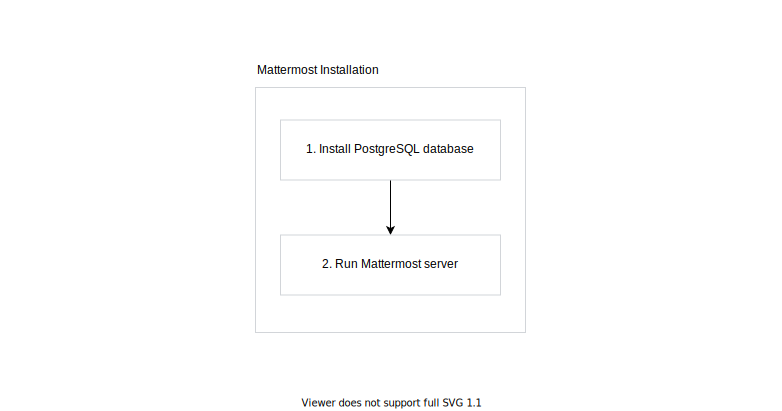
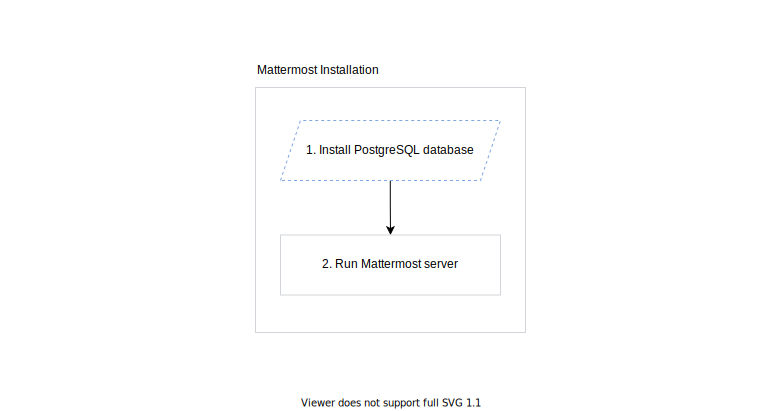
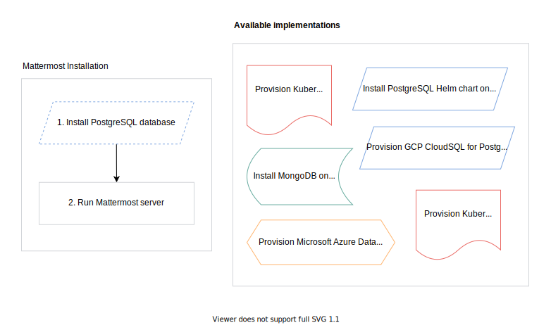
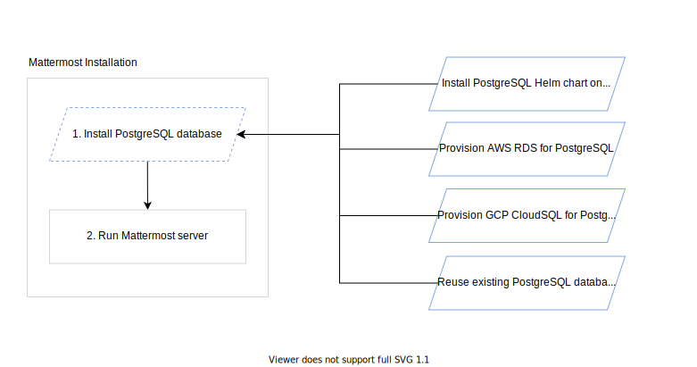
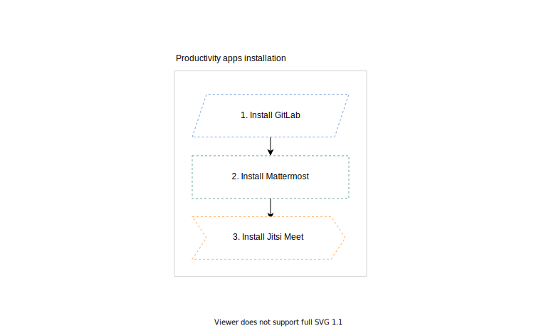

Managing the lifecycle of infrastructure, applications and processes in modern IT is problematic. 
There are a variety of tools and best practices, which are ever-changing. It's a struggle to stay up to date with these practices, and not everyone is an expert in everything. Technical debt is inevitable.

We are ultimately all alone. Siloed within the context of team, department or company, locked-in in a particular ecosystem of tooling. To deliver end-to-end capabilities, we build them from a scratch in a vacuum. We consume API calls, transform data, build and manage infrastructure and applications. Do we all really have different use cases? Don't we spend too much time on solving the same problems as others have?

What if we could share the expertise, and, in a result, save our time? While collaborating together, we ensure we use the best tools out there, following best practices. This is something that already happens—we have plenty of libraries and frameworks out there. But what if we went a step further and have a way to create, use and share building blocks that are language-agnostic abstracted capabilities?

For example, if you're not a cloud expert, all you need to know is that you want a managed PostgreSQL database on AWS and let others make it. In that way, services are managed by the experts, and you can simply focus on your business logic. If you need any Kubernetes cluster—by saying "I want any Kubernetes cluster" and letting magic happen, you could cover both local development and production scenarios...

What if I told you... **it is all possible**?

<!--truncate-->

Introducing Capact, crowdsourced expertise. Learn once, use everywhere.

## What is Capact?

Capact is a new way to manage applications and infrastructure and run arbitrary workflows. 

 
<small>source: <a href="https://tenor.com/view/here-wego-again-again-ohboy-sigh-captain-america-gif-15496881" target="_blank">tenor.com</a></small>

Yes, we get it, you already know a plenty of different tools for that. But Capact is different. How different?

Capact comes with truly unique feature—**dependencies interchangeability**. If you know the concept of interfaces from a variety of programming languages, you get the idea. Think about Capact as a way of executing workflows with steps, which are described with interfaces. An implementation for a given interface is resolved dynamically in runtime, according to your preferences. Also, these dynamic workflow steps are building blocks, which can be reused by others.

Initially, we are focused on day-one and day-two operations for managing applications and infrastructure. However, Capact is built with universal concepts in mind, which means you can run any arbitrary workflow you want. Data processing, system configuration, cluster benchmarking, auditing, running serverless workloads—the possibilities are virtually endless.

The best thing is that Capact is **fully open source** under the Apache 2.0 license. How cool is that? 😎

## Capact concept in one minute

The whole concept sounds confusing? Let's see that in action.

Let's take [Mattermost](https://mattermost.com/) installation as an example. Mattermost is an open-source alternative for Slack.

Mattermost is a Go server application, which uses PostgreSQL database. If we want to install Mattermost, this how the workflow would look like:

We need a PostgreSQL database first, to run Mattermost server. It's pretty simple. 

Now, what if we make the PostgreSQL database installation abstract? Think about that as an empty slot, where you can put a puzzle with a specific shape.

Assuming there are many puzzles out there, you see that only a few of them fit in the slot:

In the case of PostgreSQL installation, there are four puzzles that fit:

1. Install PostgreSQL Helm chart on a Kubernetes cluster
1. Provision GCP CloudSQL for PostgreSQL database
1. Provision AWS RDS for PostgreSQL database
1. Reuse existing PostgreSQL database

By default, for a workflow run, Capact picks the first puzzle that fit. However, by using [Policy](/docs/feature/policies/overview), you are in full control which puzzle will be chosen. You can select different one for a specific scenario, such as local setup, CI/CD, stage and production cluster.

What's great is that Mattermost installation is also a bigger puzzle, which can be used by others! Maybe as a part of productivity stack installation, which could consist of Mattermost, [GitLab](https://about.gitlab.com/) and [Jitsi Meet](https://jitsi.org/jitsi-meet/)? 🤔

And that's Capact. You can build your own workflows with existing puzzles, which are available inside Capact Hub. You can also create your own puzzles. Share them with community and enable [DRY](https://en.wikipedia.org/wiki/Don%27t_repeat_yourself) at a global scale, together!

## How does Capact differ from other tools?

Capact doesn't compete with the ones you already know, but integrates them instead. Whenever you are for example [Helm](https://helm.sh) or [Terraform](https://terraform.io) user, you can still use your favorite tools. Mix and match your tooling or API of choice. For example, chain Terraform, Helm and Slack API.

If you are familiar with [Kubevela](https://kubevela.io/), [Crossplane](https://crossplane.io/), and [Open Application Model](https://oam.dev/), you can see many similarities between the solution and Capact. Here are the main differences:
- Capact has a unique built-in feature—interchangeable dependencies, which allows to highly reduce amount of duplicated code.
- Capact is a workflow-based solution, which gives you more flexibility. Unlike Kubevela and Crossplane, Capact is not limited to just infrastructure and application deployment. You can use it for virtually everything.

To read a detailed comparison between Capact and other tools, see our [FAQ](/docs/faq#how-does-capact-compare-to).

## Get started with Capact

Interested in trying out Capact? Awesome! The easiest way to do so is installing it locally and trying out one of our examples to understand Capact basic concepts.

1. [Install Capact CLI](/docs/cli/getting-started),
1. [Install Capact locally with Capact CLI](/docs/installation/local),
1. [Run different scenarios of Mattermost installation example](/docs/example/mattermost-installation).  

Here are other things to do: 

⭐ **Star our GitHub repository**: If you like the idea, show your interest in the project and [give us a GitHub star](https://github.com/capactio/capact)! You can also subscribe for new Capact releases. Thank you for your support!

👉 **Follow us:** Interesting in Capact updates? Follow us on [Twitter](https://twitter.com/capactio)! Also, check out our [LinkedIn](https://www.linkedin.com/company/72586376) page and [YouTube](https://www.youtube.com/channel/UCajXtDttqVuZ_Bl7M3_qA8w) channel.

📖 **Read our documentation:** If you want to get familiar with other installation options, examples, content development or contribution guides, navigate to the [full Capact documentation](/docs).

🤔 **Get support:** If you need any help, or you have a question for the maintainers team, join our [Slack channel](/slack) on the CNCF workspace and post a message—we will help you as much as we can!

Currently, Capact is in experimental stage. We open-sourced Capact as early as possible to get early feedback and build the Capact future as a joint effort with the community.

## Wait, there's more!

In a series of future blog posts, we will highlight Capact features and cover some technical details for all interested developers out there.

Also, **a brand-new release**, Capact 0.5.0, is **just around the corner**. We're working very hard to bring many UX improvements, both for Capact users and content developers. The list includes:
- complete Action input validation, and more advanced, concurrent Capact manifests validation with optional server-side checks,
- experimental content development tools for Helm and Terraform-based (AWS and GCP) manifest generation,
- Policy syntax and behavior changes for improving consistency and usability,
- verbose output for Capact CLI,
- dependency updates, including migration to Argo 3,
- air-gapped Capact installation,
- [k3d](https://k3d.io) support,
- and much more!

Stay tuned for the official announcement!

 
<small>source: <a href="https://tenor.com/view/are-you-ready-gif-5011220" target="_blank">tenor.com</a></small>

