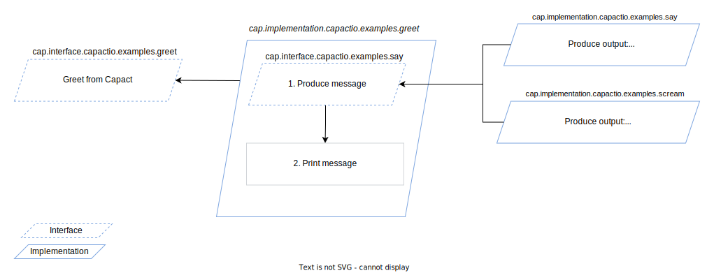
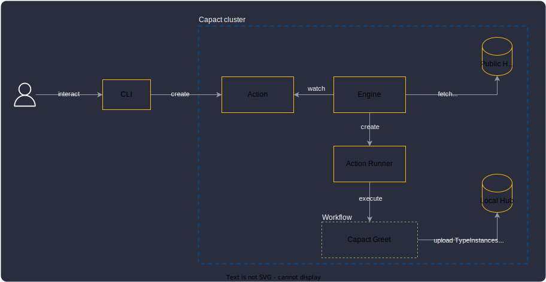

<!---
experiment with Capact
Your first night with Capact
-->

Our first blog post, focused strongly on **_why_**. Now it's time for **_how to_**. But we need to be aware that there
are many ways to [get started with Capact](https://capact.io/docs/next/getting-started). Today we will focus on you as a
Capact User.

The recommended way to try out Capact quickly is to set up a local environment. It is already nicely described in
our [local installation](https://capact.io/docs/next/installation/local) tutorial. Once you have Capact up and running
we can start!

<!---
We will use CLI not UI..
CLI - ale moge zdradzić że UI też jest.
-->

<!--truncate-->

### What you will learn

Running examples from this blog post, you will learn about the following Capact concepts:

- [Interface](https://github.com/capactio/capact/blob/main/ocf-spec/0.0.1/README.md#interface) - provides an option to
	abstract Implementations.
- [Implementation](https://github.com/capactio/capact/blob/main/ocf-spec/0.0.1/README.md#implementation) - defines
	actual workflow that is executed.
- [Attributes](https://github.com/capactio/capact/blob/main/ocf-spec/0.0.1/README.md#attribute) - provides an option to _tag_ manifests. Today we wil use it to
	select a specific Implementation.
- [Types and TypeInstances](https://github.com/capactio/capact/blob/main/ocf-spec/0.0.1/README.md#type) - defines Type schema and Type instance itself.
- [Action](https://capact.io/docs/next/terminology#action) - triggers Engine to render and run a given Interface.
- [Policies](https://capact.io/docs/next/feature/policies/overview) - impacts render process to select wanted
	Implementations.

Creating new workflows will be a story for other blog posts.

We briefly described each part, but I encourage you to take a deeper look on
our [Terminology](https://capact.io/docs/next/terminology) section after all.

:::info
For this blog post we will use Capact CLI. But describe scenario can be also execute with our [brand-new UI](/dashboard-ui/overview)! 😎
:::

### Scenario

The key concepts where described
in [introducing Capact blog post](https://capact.io/blog/introducing-capact#capact-concept-in-one-minute). There as an
example we used Mattermost. It was a real life scenario but at the same time more resource and time-consuming.

For the purpose of this blog post, we created an extremely simple Hello World example.



There are two Implementations for `cap.interface.capactio.examples.say` Interface. Depending on the Policy, a different
Implementation is selected. By default, Engine select Implementation which is first on the list and doesn't have any
requirements to be executed, e.g. requires AWS credentials.

## Camera, Lights, Action!

Action is the entrypoint for executing any Interface. It allows you to define which Interface should be executed and
with which parameters. This is later consumed by Capact Engine and appropriate workflow is rendered. You can review it
and approve for execution.



### Steps

1. [Ensure you are logged into local cluster](https://capact.io/docs/next/cli/getting-started#first-use)
2. List available Interfaces:

  ```bash
  capact hub interfaces get
  ```

  We are interested in:

    ```text {5,7,8}
                               PATH                LATEST REVISION              IMPLEMENTATIONS
    ---------------------------------------------+-----------------+-----------------------------------------------
    	# ... trimmed ...
    ---------------------------------------------+-----------------+-----------------------------------------------
    	cap.interface.capactio.examples.greet          0.1.0          cap.implementation.capactio.examples.greet
    ---------------------------------------------+-----------------+-----------------------------------------------
    	cap.interface.capactio.examples.say            0.1.0          cap.implementation.capactio.examples.scream
                                                                      cap.implementation.capactio.examples.say
    ```

3. Create a new Action:

import Tabs from '@theme/Tabs';
import TabItem from '@theme/TabItem';

<div className="tab-container-nested">
<Tabs
groupId="ref"
defaultValue="def"
values={[
{label: 'Default Execution', value: 'def'},
{label: 'Policy Adjusted Execution', value: 'policy'},
]}>
<TabItem value="def">

> **NOTE:** Policy not needed - will use default one.

```bash
capact act create --name hello cap.interface.capactio.examples.greet
```

</TabItem>
<TabItem value="policy">

First, save Policy to `/tmp/policy.yaml` file:

```yaml
cat <<EOF > /tmp/policy.yaml
rules:
 - interface:
	 path: cap.interface.capactio.examples.say
   oneOf:
   - implementationConstraints:
	   attributes:
		 - path: cap.attribute.capactio.examples.be-positive
EOF
```

Execute Action with Policy:

```bash
capact act create --name hello cap.interface.capactio.examples.greet --action-policy-from-file /tmp/policy.yaml
```

</TabItem>
</Tabs>
</div>

2. Wait for the Action to have the `READY_TO_RUN` status:
	```bash
	capact act get hello
	```
3. When the status is `READY_TO_RUN`, run the Action:
	```bash
	capact act run hello
	```
4. Watch the progress:
	```bash
	capact act watch hello
	```
5. **(Optional)** Once the Action is finished, note the name of the Pod for the `print` workflow step (column `PODNAME`). To read its logs, run:
	```bash
	kubectl logs {PODNAME} main
	```

6. Get the Action output (TypeInstances). Note the `id` filed value:
	```bash
	capact act get hello -ojson | jq '.Actions[0].output.typeInstances'
	```

	Example output:
	```bash {3}
	[
	  {
	    "id": "08fcaa07-7846-47af-b6a7-7c3818c69656",
	    "typeRef": {
	      "path": "cap.type.capactio.examples.message",
	      "revision": "0.1.0"
	    }
      }
	]
	```

7. Get the TypeInstance `value.greeting` field value:

	 ```bash
	 capact ti get {TI_ID} | jq -r '.[0].latestResourceVersion.spec.value.greeting'
	 ```

8. Delete the Action:

	 ```bash
	 capact act delete hello
	 ```

Let's consider another example, as life isn’t all sunshine and rainbows. Sometimes we need more positively colored
message. Capact allows you to do it with an easy ✨

To choose a different Implementation for the `say` Interface we need to prepare a dedicated Policy. The power of it is that you don't have to change the main workflow. You just change the
building blocks in already created one. Execute [steps](#steps) once again, but now select the **Policy Adjusted Execution** tab.

## Behind the wall

As you could learn, using CLI you can browse Hub manifests and create specifc Action for a given Interface. CLI
communicates with our Gateway via GraphQL calls. More about it you can learn
in [E2E Achitecture](/architecture/e2e-architecture) document.

```yaml {4}
# ... trimmed ...
steps:
  - - name: get-message
      capact-action: examples.say # dynamic step, rendered by Engine based on Policy.
  - - name: print
      template: print
      arguments:
        artifacts:
          - name: message
          from: "{{steps.get-message.outputs.artifacts.message}}"
# ... trimmed ...
- name: print
  inputs:
    artifacts:
      - name: message
      path: /tmp/message.yaml
  container:
    image: docker/whalesay:latest
    command: [ sh, -c ]
    args: [ "cowsay < /tmp/message.yaml" ]
```

## How can I get involved and learn more?

The [Getting Started](/docs/getting-started) goes into more detail about how to start with Capact and use its more advanced features.
There are also [Rocket.Chat](https://github.com/google/wire/tree/master/_tutorial)
and [Mattermost] tutorials that we keep up-to-date for you, to that walk you through using Capact with real cases.

We appreciate any input you have about your experience with Capact! There are plany of option to contact us:
- [GitHub issues](https://github.com/capactio/capact/issues)
- [Slack workspace](/slack)
- Email us at [contact@capact.io](mailto:contact@capact.io)

Thank you for taking the time to learn about Capact 🙌

---


same as UI. Regarding UI, Spoiler with UI window? - the newest UI leaks?

3. Mention the TypeInstances (output) - check the dev guide.
3. Refer to blog post about changing dependency - default policy
7. Argo UI?

## What is so special about this example?

Our example was simplified to a minimum, but you could see that:

- You have a single entrypoint (same UX) for different tools
- Write once, swap implementation details as you want (with an easy.)
- Chain different steps one after another, with an easy.

# Description

## Prerequisite

1. Capact CLI at least v0.5.0
2. Capact cluster at least v0.5.0
3. Kubectl
4. `jq`

However, most importantly it can help reduce risk in a new way – by going fast but small.
