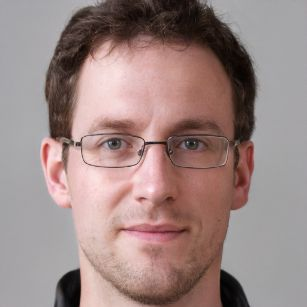
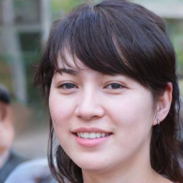

# User profiles

This document aggregates user profiles and personas, which help us design, develop and document new Capact features by evaluating them against those who will be using them.

## Profiles

This section describes general roles of users, which we focus on, while developing and documenting new features. A real person may have multiple roles assigned.

The list is ordered to highlight the priority of focus for the user experience for different roles.

1. **System User**

    System User operates Capact Actions and manages TypeInstances related to the Actions. System User executes arbitrary Actions. For example, Actions which install applications and provision infrastructure Mattermost, provisioning Kubernetes cluster, or creating new PostgreSQL user.

1. **System Administrator**

    System Administrator operates Capact installation, that is, performs any day-one and day-two operations around installed Capact. Also, System Administrator manages global configuration for all System Users, such as [Global Policy](/docs/feature/policies/global-policy) or Capact Hub source.

1. **Content Developer**

    Content Developer develops new content, that is, Capact manifests and applications run in containers as a part of Implementations. One of the examples of such applications are [Runners](/docs/architecture/runner). Content Developer also integrates the developed content into existing Hub manifests.

1. **Capact Developer**

    Capact Developer is a person who develops the Capact itself. This group includes not only the project maintainers, but also any contributor which improves Capact with a bug fix, feature implementation or documentation update.

## Personas

This section describes fictional characters that represent typical users based on the [user profiles](#profiles). They were created to better understand expectations, concerns and motivation of target users.

Images have been downloaded from [thispersondoesnotexist.com](https://thispersondoesnotexist.com/).

### James

#### Description

James is a talented 29 years old dev-ops engineer, which works at Schuppe company. Few years ago he completed bachelor's in Computer Science. At work, he builds CI/CD pipelines and environments for different teams inside the company. From time to time, he also helps with deployment and configuration of organization-wide productivity applications. 

James is an open source enthusiast. While he likes cloud-native technologies, he prefers not to constantly learn new tools. He definitely doesn't like to implement something that's already out there in the open source community.

Recently, he discovered Capact and started to use it for everyday tasks. He tries to reuse as many existing Capact content as he can, but if he sees a missing gap, he develops the manifests and contributes them to Capact.

#### Roles

- System User
- System Administrator
- Content Developer

#### Personality

- Ambivert (half-introvert, half-extrovert)
- Pragmatic
- Prefers not to constantly learn new tools

#### Goals

- Get stuff done as fast as possible
- Automating as many things as possible
- Using libraries and projects from open-source community

#### Frustrations

- Writing boilerplate code
- Implementing stuff that's already out there in open-source community
- Missing or incomplete documentation for projects he uses

### Simone

#### Description

Simone is a software engineer working in a small company called Stomerce Software. The company provides e-commerce solution, both in a form of SaaS and on-premise offering. Stomerce Software has a limited support team and the leadership is not interested in providing professional services. Instead, the company wants to focus on offering the best end-user self-service experience possible.

Simone is a member of a team responsible for application delivery and minimizing the amount of friction around product adoption. Very often, Simone helps the support team and assists customers with the on-premise application. Usual problems she tackles with are: app deployment on different environments, upgrade, backup and restore.

Recently, Simone discovered Capact, and she thinks that it will help the company achieve the goals. She develops Capact manifests to provide unified day-one and day-two operations for the on-premise app.

#### Roles

- Content Developer

#### Personality

- Extrovert
- Patient
- Determined

#### Goals

- Standardize day-one and day-two operations for the software regardless of the different setup
- Provide self-service options for the customers
- Reduce time spend on customer support

#### Frustrations

- Fragmentation of tooling used by customers
- It's hard to support many deployment and management options
- More time spent on customer assistance than developing new features
