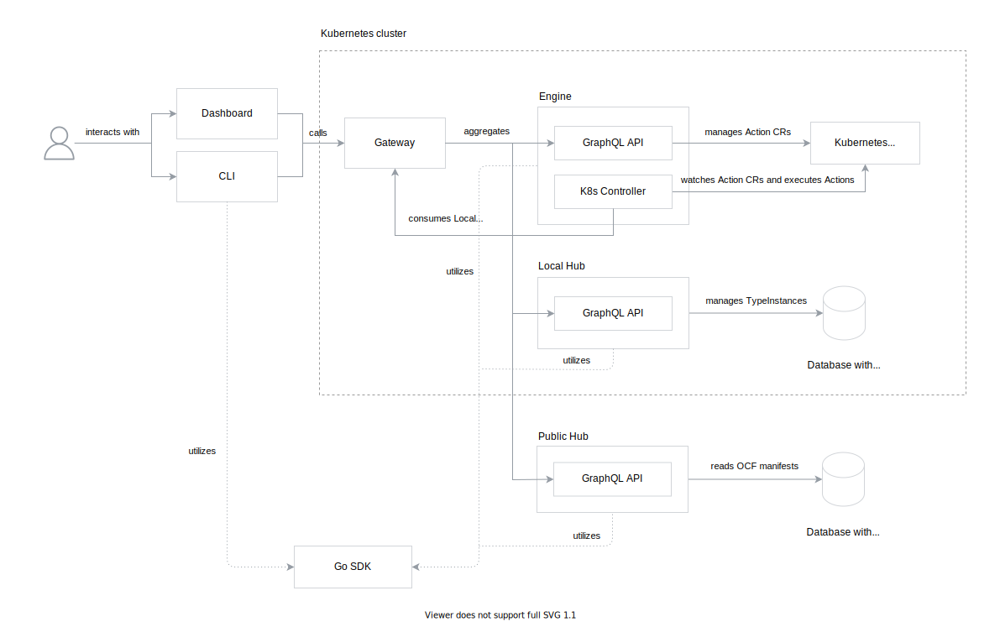

# E2E Architecture

The document describes high-level Capact architecture, all components in the system and interactions between them.

> **NOTE**: This document showcases the Capact architecture for initial phase of the development. The target GA architecture may differ, and it will be documented later.

## Components

The following diagram visualizes all components in the system:

### OCF

Open Capability Format (OCF) is not a component per-se, but it's also an important part of the system. OCF is a specification of manifests for every entity in the system.
It is stored in a form of multiple JSON Schema files. From the JSON schemas all internal [SDK](#sdk) Go structs are generated.

OCF manifests are stored in [Hub](#hub).

### CLI

CLI is command line tool which makes easier to manage [OCF](#ocf) manifests and Actions.

To read the documentation about CLI tool, see the [Getting started](../cli/getting-started.mdx) document.

CLI utilizes [SDK](#sdk).

### Dashboard

Dashboard is a web-based user interface for managing Capact resources, such as Actions.

To read more about Dashboard, see the [Overview](../dashboard-ui/overview.md) document.

### Gateway

Gateway is a GraphQL reverse proxy. It aggregates multiple remote GraphQL schemas into a single endpoint. It enables [CLI](#cli) and other clients to have a single destination for all GraphQL operations.

Based on the GraphQL operation, it forwards the query or mutation to a corresponding service:
- [Engine](#engine) - for CRUD operations on Actions,
- Local [Hub](#hub) - for create, read, delete operations on TypeInstances,
- Public [Hub](#hub) - for read operations for all other manifests except for TypeInstance.

It also runs an additional GraphQL server, which exposes single mutation to change URL for Public [Hub](#hub) API aggregated by Gateway.

### Engine

Engine is responsible for validating, rendering and executing Actions. Action describes user intention in platform-agnostic way - which Interface or Implementation to run with a given input parameters and artifacts. For Kubernetes implementation, we use Kubernetes Custom Resources to store Action data.

Engine composes of two modules:
- GraphQL API server, which exposes platform-agnostic API for managing Actions,
- Kubernetes operator, which handles Action validation, rendering and execution based on Action Custom Resources `spec` property.

To resolve Actions, Engine uses GraphQL queries for TypeInstances, Interface and Implementations through Gateway.

Engine utilizes [SDK](#sdk). To execute Actions, it uses Kubernetes Jobs, that executes [Argo](https://github.com/argoproj/argo) workflows.

### Hub

Capact Hub stores [OCF](#ocf) manifests and exposes API to access and manage them. It uses graph database as a storage for the data.

Hub works in two modes:
- Local Hub exposes GraphQL API for managing TypeInstances (create, read, delete operations),
- Public Hub, which exposes read-only GraphQL API for querying all OCF manifests except TypeInstances.

Every manifest for Public Hub has to be signed with [CLI](#cli). Signed manifests are populated with DB Populator, which populates the graph database directly from a given directory structure.

Hub utilizes [SDK](#sdk).

### SDK

SDK is a Go library with low-level and high-level functions used by [Engine](#engine), [Hub](#hub) and [CLI](#cli).

SDK can be used by Users to interact with Capact components in a programmatic way.

## Detailed interaction

The section contains detailed interaction diagrams, to understand how the system works in a higher level of detail.

### Executing Action

On the following diagram, User executes the Mattermost installation using [CLI](#cli).

> **NOTE:** To make the diagram more readable, some details have been omitted, such as TypeInstance injection into workflow and details about watching built-in Runner status. Also, the Gateway component was excluded. Every operation proxied by Gateway is described with _(via Gateway)_ phrase.

