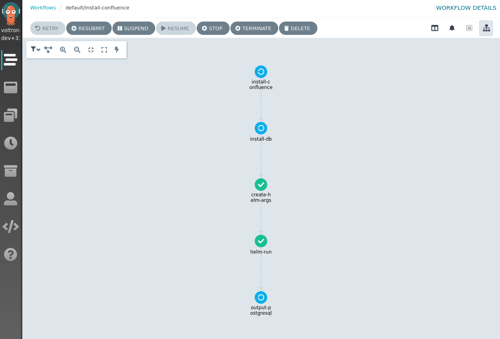

# Guide

## Introduction

This guide shows the first steps on how to develop OCF content for Capact. We will show how to:
- define new **Types** and **Interfaces**,
- create **Implementation** for the **Interfaces**,
- use other **Interfaces** in your **Implementations**,
- test the new manifests on a local development Capact cluster.

As an example, we will create OCF manifests to deploy Mattermost with a PostgreSQL database.

## Prerequisites

To develop and test the created content, you will need to have a Capact environment. To set up a local environment, install the following prerequisites:

* [Docker](https://docs.docker.com/engine/install/)
* [kind](https://kind.sigs.k8s.io/docs/user/quick-start/#installation)
* [kubectl](https://kubernetes.io/docs/tasks/tools/install-kubectl/)
* [Capact CLI](../cli/getting-started.mdx)
* [populator](https://github.com/capactio/capact/tree/main/cmd/populator/docs/populator_register-ocf-manifests.md) - For now, you need to compile it from source

Also, clone the repository with the Capact manifests:

```bash
git clone git@github.com:capactio/hub-manifests.git
```

Some other materials worth reading before are:
- [Mattermost installation tutorial](../example/mattermost-installation.md) - Learn how to execute actions in Capact.
- [Argo Workflows documentation](https://argoproj.github.io/argo-workflows/) - Capact action syntax is based on Argo workflows, so it's highly recommended you understand what is Argo and how to create Argo workflows.
- [Capact runners](../architecture/runner.md) - Understand, what are Capact runners.
- [Capact CLI validate command](../cli/commands/capact_manifest_validate.md) - Learn how to validate your manifests syntax.

## Types, Interfaces and Implementations

If you have some software development experience, concepts like types and interfaces should be familiar to you. In Capact, **Types** represent different objects in the environment. These could be database or application instances, servers, but also more abstract things, like an IP address or hostname.
An actual object of a **Type** is called a **TypeInstance**.

**Interfaces** are operations, which can be executed on certain **Types**. Let's say we have a **Type** called `postgresql.config`, which represents a PostgreSQL database instance. We could have an **Interface** `postgresql.install`, which will provision a PostgreSQL instance and create a **TypeInstance** of `postgresql.config`.

**Interfaces** can be grouped into **InterfaceGroups**. **InterfaceGroups** are used to logically group the **Interfaces**. This is mostly used for presentation purposes, like to show the user all **Interfaces**, which operate on PostgreSQL instances. So if you have two **Interfaces**: `postgresql.install` and `postgresql.uninstall`, you can group them into `postgresql` InterfaceGroup.

Of course, there are multiple ways to create a PostgreSQL instance: you can create it on a public cloud or on-premise, and you could deploy it as a virtual machine or as a Kubernetes StatefulSet. To cover these scenarios, Capact allows defining multiple **Implementations** of some **Interfaces**. For example:
- `aws.postgresql.install` **Implementation** of the `postgresql.install` **Interface** will deploy AWS RDS instances, whereas
- `bitnami.postgresql.install` **Implementation** will deploy a PostgreSQL Helm chart on Kubernetes.

## Define your Types and Interfaces

Let's try to create manifests required to define a capability to install [Mattermost](https://mattermost.com/) server. We will need to create the following entities:
- `mattermost.config` **Type** - Represents a Mattermost server.
- `mattermost.install-input` **Type** - Represents input parameters needed to install a Mattermost server.
- `mattermost` **InterfaceGroup** - Groups **Interfaces** from the `mattermost` group, e.g. if you have `mattermost.install` and `mattermost.upgrade` **Interfaces**.
- `mattermost.install` **Interface** - An operation, which installs Mattermost servers. You can think of it as a function:
  ```
  mattermost.install(mattermost.install-input) -> mattermost.config
  ```

### Create the Interface Group manifest

First, we need to create an **InterfaceGroup** manifest, which groups **Interfaces** corresponding to some application.
Let's create a InterfaceGroup called `cap.interface.productivity.mattermost`, which will group **Interfaces** operating on Mattermost instances.

In `manifests/interface/productivity/`, create a file called `mattermost.yaml`, with the following content:

<details>
  <summary>manifests/interface/productivity/mattermost.yaml</summary>

```yaml
ocfVersion: 0.0.1
revision: 0.1.0
kind: InterfaceGroup
metadata:
  prefix: cap.interface.productivity
  name: mattermost
  displayName: "Mattermost"
  description: "Mattermost is an open source collaboration tool for developers."
  documentationURL: https://docs.mattermost.com/
  supportURL: https://docs.mattermost.com/
  iconURL: https://docs.mattermost.com/_static/images/Mattermost-Logo-Blue.svg
  maintainers:
    - email: your.email@example.com
      name: your-name
      url: your-website
```
</details>

### Create the Interface manifest

After we have the **InterfaceGroup**, let's create the **Interface** for installing Mattermost.
Create the directory `manifests/interface/productivity/mattermost`.

Inside this directory, create a file `install.yaml` with the following content:

<details>
  <summary>manifests/interface/productivity/mattermost/install.yaml</summary>

```yaml
ocfVersion: 0.0.1
revision: 0.1.0
kind: Interface
metadata:
  prefix: cap.interface.productivity.mattermost
  name: install
  displayName: "Install Mattermost Team Edition"
  description: "Install action for Mattermost Team Edition"
  documentationURL: https://docs.mattermost.com/
  supportURL: https://docs.mattermost.com/
  iconURL: https://docs.mattermost.com/_static/images/Mattermost-Logo-Blue.svg
  maintainers:
    - email: your.email@example.com
      name: your-name
      url: your-website

spec:
  input:
    parameters: # the Interface requires `input-parameters` of Type "cap.type.productivity.mattermost.install-input"
      input-parameters:
        typeRef:
          path: cap.type.productivity.mattermost.install-input
          revision: 0.1.0

  output:
    typeInstances: # the Interface outputs TypeInstance of Type "cap.type.productivity.mattermost.config"
      mattermost-config:
        typeRef:
          path: cap.type.productivity.mattermost.config
          revision: 0.1.0
```
</details>

The `spec.input` property defines inputs, required by the **Interface**. There are two types of inputs:
- `spec.input.parameters` - User provided input parameters, i.e. these could be configuration parameters required by the operation,
- `spec.input.typeInstances` - input **TypeInstances**, i.e. a PostgreSQL database, which is needed for an application.

The `spec.output` property defines the **TypeInstance**, which this **Interface** returns.

Although Mattermost needs a database, we don't specify it as an input argument here. That is because, we leave selecting a database to the **Implementation**.

### Create the Type manifests

Now we need to define the two **Types**, which we use in our **Interface**: `cap.type.productivity.mattermost.install-input` and `cap.type.productivity.mattermost.config`.

<details>
  <summary>manifests/type/productivity/mattermost/install-input.yaml</summary>

```yaml
ocfVersion: 0.0.1
revision: 0.1.0
kind: Type
metadata:
  name: install-input
  prefix: cap.type.productivity.mattermost
  displayName: "Mattermost install input"
  description: Defines installation parameters for Mattermost
  documentationURL: https://docs.mattermost.com/
  supportURL: https://docs.mattermost.com
  maintainers:
    - email: your.email@example.com
      name: your-name
      url: your-website

spec:
  jsonSchema:
    value: |-
      {
        "$schema": "http://json-schema.org/draft-07/schema",
        "type": "object",
        "title": "Mattermost installation parameters",
         "required": [
           "host"
        ],
        "properties": {
          "host": {
            "$id": "#/properties/host",
            "type": "string",
            "title": "Host of the Mattermost Instance"
          },
          "configJSON": {
            "$id": "#/properties/configJSON",
            "type": "object",
            "title": "Configuration",
            "properties": {
              "ServiceSettings": {
                "title": "Service Settings",
                "$id": "#/properties/configJSON/properties/ServiceSettings",
                "type": "object",
                "properties": {
                  "LicenseFileLocation": {
                    "title": "License File Location",
                    "$id": "#/properties/configJSON/properties/ServiceSettings/properties/LicenseFileLocation",
                    "type": "string",
                    "default": ""
                  },
                  "ListenAddress": {
                    "title": "Listen Address",
                    "$id": "#/properties/configJSON/properties/ServiceSettings/properties/ListenAddress",
                    "type": "string",
                    "default": ":8065"
                  },
                  "ConnectionSecurity": {
                    "title": "Connection Security",
                    "$id": "#/properties/configJSON/properties/ServiceSettings/properties/ConnectionSecurity",
                    "type": "string",
                    "default": ""
                  },
                  "TLSCertFile": {
                    "title": "TLS Cert File",
                    "$id": "#/properties/configJSON/properties/ServiceSettings/properties/TLSCertFile",
                    "type": "string",
                    "default": ""
                  },
                  "TLSKeyFile": {
                    "title": "TLS Key File",
                    "$id": "#/properties/configJSON/properties/ServiceSettings/properties/TLSKeyFile",
                    "type": "string",
                    "default": ""
                  },
                  "UseLetsEncrypt": {
                    "title": "Use Lets Encrypt",
                    "$id": "#/properties/configJSON/properties/ServiceSettings/properties/UseLetsEncrypt",
                    "type": "boolean",
                    "default": false
                  },
                  "LetsEncryptCertificateCacheFile": {
                    "title": "Lets Encrypt Certificate Cache File",
                    "$id": "#/properties/configJSON/properties/ServiceSettings/properties/LetsEncryptCertificateCacheFile",
                    "type": "string",
                    "default": "./config/letsencrypt.cache"
                  },
                  "Forward80To443": {
                    "title": "Forward 80 To 443",
                    "$id": "#/properties/configJSON/properties/ServiceSettings/properties/Forward80To443",
                    "type": "boolean",
                    "default": false
                  },
                  "ReadTimeout": {
                    "title": "Read Timeout",
                    "$id": "#/properties/configJSON/properties/ServiceSettings/properties/ReadTimeout",
                    "type": "number",
                    "default": 300
                  },
                  "WriteTimeout": {
                    "title": "Write Timeout",
                    "$id": "#/properties/configJSON/properties/ServiceSettings/properties/WriteTimeout",
                    "type": "number",
                    "default": 300
                  },
                  "MaximumLoginAttempts": {
                    "title": "Maximum Login Attempts",
                    "$id": "#/properties/configJSON/properties/ServiceSettings/properties/MaximumLoginAttempts",
                    "type": "number",
                    "default": 10
                  },
                  "GoroutineHealthThreshold": {
                    "title": "Goroutine Health Threshold",
                    "$id": "#/properties/configJSON/properties/ServiceSettings/properties/GoroutineHealthThreshold",
                    "type": "number",
                    "default": -1
                  },
                  "GoogleDeveloperKey": {
                    "title": "Google Developer Key",
                    "$id": "#/properties/configJSON/properties/ServiceSettings/properties/GoogleDeveloperKey",
                    "type": "string",
                    "default": ""
                  },
                  "EnableOAuthServiceProvider": {
                    "title": "Enable OAuth Service Provider",
                    "$id": "#/properties/configJSON/properties/ServiceSettings/properties/EnableOAuthServiceProvider",
                    "type": "boolean",
                    "default": false
                  },
                  "EnableIncomingWebhooks": {
                    "title": "Enable Incoming Webhooks",
                    "$id": "#/properties/configJSON/properties/ServiceSettings/properties/EnableIncomingWebhooks",
                    "type": "boolean",
                    "default": true
                  },
                  "EnableOutgoingWebhooks": {
                    "title": "Enable Outgoing Webhooks",
                    "$id": "#/properties/configJSON/properties/ServiceSettings/properties/EnableOutgoingWebhooks",
                    "type": "boolean",
                    "default": true
                  },
                  "EnableCommands": {
                    "title": "Enable Commands",
                    "$id": "#/properties/configJSON/properties/ServiceSettings/properties/EnableCommands",
                    "type": "boolean",
                    "default": true
                  },
                  "EnableOnlyAdminIntegrations": {
                    "title": "Enable Only Admin Integrations",
                    "$id": "#/properties/configJSON/properties/ServiceSettings/properties/EnableOnlyAdminIntegrations",
                    "type": "boolean",
                    "default": false
                  },
                  "EnablePostUsernameOverride": {
                    "title": "Enable Post Username Override",
                    "$id": "#/properties/configJSON/properties/ServiceSettings/properties/EnablePostUsernameOverride",
                    "type": "boolean",
                    "default": false
                  },
                  "EnablePostIconOverride": {
                    "title": "Enable Post Icon Override",
                    "$id": "#/properties/configJSON/properties/ServiceSettings/properties/EnablePostIconOverride",
                    "type": "boolean",
                    "default": false
                  },
                  "EnableBotAccountCreation": {
                    "title": "Enable Bot Account Creation",
                    "$id": "#/properties/configJSON/properties/ServiceSettings/properties/EnableBotAccountCreation",
                    "type": "boolean",
                    "default": false
                  },
                  "EnableUserAccessTokens": {
                    "title": "Enable User Access Tokens",
                    "$id": "#/properties/configJSON/properties/ServiceSettings/properties/EnableUserAccessTokens",
                    "type": "boolean",
                    "default": false
                  },
                  "EnableLinkPreviews": {
                    "title": "Enable Link Previews",
                    "$id": "#/properties/configJSON/properties/ServiceSettings/properties/EnableLinkPreviews",
                    "type": "boolean",
                    "default": false
                  },
                  "EnableTesting": {
                    "title": "Enable Testing",
                    "$id": "#/properties/configJSON/properties/ServiceSettings/properties/EnableTesting",
                    "type": "boolean",
                    "default": false
                  },
                  "EnableDeveloper": {
                    "title": "Enable Developer",
                    "$id": "#/properties/configJSON/properties/ServiceSettings/properties/EnableDeveloper",
                    "type": "boolean",
                    "default": false
                  },
                  "EnableSecurityFixAlert": {
                    "title": "Enable Security Fix Alert",
                    "$id": "#/properties/configJSON/properties/ServiceSettings/properties/EnableSecurityFixAlert",
                    "type": "boolean",
                    "default": true
                  },
                  "EnableInsecureOutgoingConnections": {
                    "title": "Enable Insecure Outgoing Connections",
                    "$id": "#/properties/configJSON/properties/ServiceSettings/properties/EnableInsecureOutgoingConnections",
                    "type": "boolean",
                    "default": false
                  },
                  "EnableMultifactorAuthentication": {
                    "title": "Enable Multifactor Authentication",
                    "$id": "#/properties/configJSON/properties/ServiceSettings/properties/EnableMultifactorAuthentication",
                    "type": "boolean",
                    "default": false
                  },
                  "EnforceMultifactorAuthentication": {
                    "title": "Enforce Multifactor Authentication",
                    "$id": "#/properties/configJSON/properties/ServiceSettings/properties/EnforceMultifactorAuthentication",
                    "type": "boolean",
                    "default": false
                  },
                  "AllowCorsFrom": {
                    "title": "Allow Cors From",
                    "$id": "#/properties/configJSON/properties/ServiceSettings/properties/AllowCorsFrom",
                    "type": "string",
                    "default": ""
                  },
                  "SessionLengthWebInDays": {
                    "title": "Session Length Web In Days",
                    "$id": "#/properties/configJSON/properties/ServiceSettings/properties/SessionLengthWebInDays",
                    "type": "number",
                    "default": 30
                  },
                  "SessionLengthMobileInDays": {
                    "title": "Session Length Mobile In Days",
                    "$id": "#/properties/configJSON/properties/ServiceSettings/properties/SessionLengthMobileInDays",
                    "type": "number",
                    "default": 30
                  },
                  "SessionLengthSSOInDays": {
                    "title": "Session Length SSO In Days",
                    "$id": "#/properties/configJSON/properties/ServiceSettings/properties/SessionLengthSSOInDays",
                    "type": "number",
                    "default": 30
                  },
                  "SessionCacheInMinutes": {
                    "title": "Session Cache In Minutes",
                    "$id": "#/properties/configJSON/properties/ServiceSettings/properties/SessionCacheInMinutes",
                    "type": "number",
                    "default": 10
                  },
                  "WebsocketSecurePort": {
                    "title": "Websocket Secure Port",
                    "$id": "#/properties/configJSON/properties/ServiceSettings/properties/WebsocketSecurePort",
                    "type": "number",
                    "default": 443
                  },
                  "WebsocketPort": {
                    "title": "Websocket Port",
                    "$id": "#/properties/configJSON/properties/ServiceSettings/properties/WebsocketPort",
                    "type": "number",
                    "default": 80
                  },
                  "WebserverMode": {
                    "title": "Webserver Mode",
                    "$id": "#/properties/configJSON/properties/ServiceSettings/properties/WebserverMode",
                    "type": "string",
                    "default": "gzip"
                  },
                  "EnableCustomEmoji": {
                    "title": "Enable Custom Emoji",
                    "$id": "#/properties/configJSON/properties/ServiceSettings/properties/EnableCustomEmoji",
                    "type": "boolean",
                    "default": false
                  },
                  "RestrictCustomEmojiCreation": {
                    "title": "Restrict Custom Emoji Creation",
                    "$id": "#/properties/configJSON/properties/ServiceSettings/properties/RestrictCustomEmojiCreation",
                    "type": "string",
                    "default": "all"
                  },
                  "RestrictPostDelete": {
                    "title": "Restrict Post Delete",
                    "$id": "#/properties/configJSON/properties/ServiceSettings/properties/RestrictPostDelete",
                    "type": "string",
                    "default": "all"
                  },
                  "AllowEditPost": {
                    "title": "Allow Edit Post",
                    "$id": "#/properties/configJSON/properties/ServiceSettings/properties/AllowEditPost",
                    "type": "string",
                    "default": "always"
                  },
                  "PostEditTimeLimit": {
                    "title": "Post Edit Time Limit",
                    "$id": "#/properties/configJSON/properties/ServiceSettings/properties/PostEditTimeLimit",
                    "type": "number",
                    "default": 300
                  },
                  "TimeBetweenUserTypingUpdatesMilliseconds": {
                    "title": "Time Between User Typing Updates Milliseconds",
                    "$id": "#/properties/configJSON/properties/ServiceSettings/properties/TimeBetweenUserTypingUpdatesMilliseconds",
                    "type": "number",
                    "default": 5000
                  },
                  "EnablePostSearch": {
                    "title": "Enable Post Search",
                    "$id": "#/properties/configJSON/properties/ServiceSettings/properties/EnablePostSearch",
                    "type": "boolean",
                    "default": true
                  },
                  "EnableUserTypingMessages": {
                    "title": "Enable User Typing Messages",
                    "$id": "#/properties/configJSON/properties/ServiceSettings/properties/EnableUserTypingMessages",
                    "type": "boolean",
                    "default": true
                  },
                  "EnableUserStatuses": {
                    "title": "Enable User Statuses",
                    "$id": "#/properties/configJSON/properties/ServiceSettings/properties/EnableUserStatuses",
                    "type": "boolean",
                    "default": true
                  },
                  "ClusterLogTimeoutMilliseconds": {
                    "title": "Cluster Log Timeout Milliseconds",
                    "$id": "#/properties/configJSON/properties/ServiceSettings/properties/ClusterLogTimeoutMilliseconds",
                    "type": "number",
                    "default": 2000
                  }
                }
              },
              "TeamSettings": {
                "title": "Team Settings",
                "$id": "#/properties/configJSON/properties/TeamSettings",
                "type": "object",
                "properties": {
                  "SiteName": {
                    "title": "Site Name",
                    "$id": "#/properties/configJSON/properties/TeamSettings/properties/SiteName",
                    "type": "string",
                    "default": "Mattermost"
                  },
                  "MaxUsersPerTeam": {
                    "title": "Max Users Per Team",
                    "$id": "#/properties/configJSON/properties/TeamSettings/properties/MaxUsersPerTeam",
                    "type": "number",
                    "default": 50000
                  },
                  "EnableTeamCreation": {
                    "title": "Enable Team Creation",
                    "$id": "#/properties/configJSON/properties/TeamSettings/properties/EnableTeamCreation",
                    "type": "boolean",
                    "default": true
                  },
                  "EnableUserCreation": {
                    "title": "Enable User Creation",
                    "$id": "#/properties/configJSON/properties/TeamSettings/properties/EnableUserCreation",
                    "type": "boolean",
                    "default": true
                  },
                  "EnableOpenServer": {
                    "title": "Enable Open Server",
                    "$id": "#/properties/configJSON/properties/TeamSettings/properties/EnableOpenServer",
                    "type": "boolean",
                    "default": true
                  },
                  "RestrictCreationToDomains": {
                    "title": "Restrict Creation To Domains",
                    "$id": "#/properties/configJSON/properties/TeamSettings/properties/RestrictCreationToDomains",
                    "type": "string",
                    "default": ""
                  },
                  "EnableCustomBrand": {
                    "title": "Enable Custom Brand",
                    "$id": "#/properties/configJSON/properties/TeamSettings/properties/EnableCustomBrand",
                    "type": "boolean",
                    "default": false
                  },
                  "CustomBrandText": {
                    "title": "Custom Brand Text",
                    "$id": "#/properties/configJSON/properties/TeamSettings/properties/CustomBrandText",
                    "type": "string",
                    "default": ""
                  },
                  "CustomDescriptionText": {
                    "title": "Custom Description Text",
                    "$id": "#/properties/configJSON/properties/TeamSettings/properties/CustomDescriptionText",
                    "type": "string",
                    "default": ""
                  },
                  "RestrictDirectMessage": {
                    "title": "Restrict Direct Message",
                    "$id": "#/properties/configJSON/properties/TeamSettings/properties/RestrictDirectMessage",
                    "type": "string",
                    "default": "any"
                  },
                  "RestrictTeamInvite": {
                    "title": "Restrict Team Invite",
                    "$id": "#/properties/configJSON/properties/TeamSettings/properties/RestrictTeamInvite",
                    "type": "string",
                    "default": "all"
                  },
                  "RestrictPublicChannelManagement": {
                    "title": "Restrict Public Channel Management",
                    "$id": "#/properties/configJSON/properties/TeamSettings/properties/RestrictPublicChannelManagement",
                    "type": "string",
                    "default": "all"
                  },
                  "RestrictPrivateChannelManagement": {
                    "title": "Restrict Private Channel Management",
                    "$id": "#/properties/configJSON/properties/TeamSettings/properties/RestrictPrivateChannelManagement",
                    "type": "string",
                    "default": "all"
                  },
                  "RestrictPublicChannelCreation": {
                    "title": "Restrict Public Channel Creation",
                    "$id": "#/properties/configJSON/properties/TeamSettings/properties/RestrictPublicChannelCreation",
                    "type": "string",
                    "default": "all"
                  },
                  "RestrictPrivateChannelCreation": {
                    "title": "Restrict Private Channel Creation",
                    "$id": "#/properties/configJSON/properties/TeamSettings/properties/RestrictPrivateChannelCreation",
                    "type": "string",
                    "default": "all"
                  },
                  "RestrictPublicChannelDeletion": {
                    "title": "Restrict Public Channel Deletion",
                    "$id": "#/properties/configJSON/properties/TeamSettings/properties/RestrictPublicChannelDeletion",
                    "type": "string",
                    "default": "all"
                  },
                  "RestrictPrivateChannelDeletion": {
                    "title": "Restrict Private Channel Deletion",
                    "$id": "#/properties/configJSON/properties/TeamSettings/properties/RestrictPrivateChannelDeletion",
                    "type": "string",
                    "default": "all"
                  },
                  "RestrictPrivateChannelManageMembers": {
                    "title": "Restrict Private Channel Manage Members",
                    "$id": "#/properties/configJSON/properties/TeamSettings/properties/RestrictPrivateChannelManageMembers",
                    "type": "string",
                    "default": "all"
                  },
                  "UserStatusAwayTimeout": {
                    "title": "User Status Away Timeout",
                    "$id": "#/properties/configJSON/properties/TeamSettings/properties/UserStatusAwayTimeout",
                    "type": "number",
                    "default": 300
                  },
                  "MaxChannelsPerTeam": {
                    "title": "Max Channels Per Team",
                    "$id": "#/properties/configJSON/properties/TeamSettings/properties/MaxChannelsPerTeam",
                    "type": "number",
                    "default": 50000
                  },
                  "MaxNotificationsPerChannel": {
                    "title": "Max Notifications Per Channel",
                    "$id": "#/properties/configJSON/properties/TeamSettings/properties/MaxNotificationsPerChannel",
                    "type": "number",
                    "default": 1000
                  }
                }
              },
              "SqlSettings": {
                "title": "Sql Settings",
                "$id": "#/properties/configJSON/properties/SqlSettings",
                "type": "object",
                "properties": {
                  "DriverName": {
                    "title": "Driver Name",
                    "$id": "#/properties/configJSON/properties/SqlSettings/properties/DriverName",
                    "type": "string",
                    "default": ""
                  },
                  "DataSource": {
                    "title": "Data Source",
                    "$id": "#/properties/configJSON/properties/SqlSettings/properties/DataSource",
                    "type": "string",
                    "default": ""
                  },
                  "DataSourceReplicas": {
                    "title": "Data Source Replicas",
                    "$id": "#/properties/configJSON/properties/SqlSettings/properties/DataSourceReplicas",
                    "type": "array",
                    "items": {
                      "type": "string"
                    },
                    "default": []
                  },
                  "DataSourceSearchReplicas": {
                    "title": "Data Source Search Replicas",
                    "$id": "#/properties/configJSON/properties/SqlSettings/properties/DataSourceSearchReplicas",
                    "type": "array",
                    "items": {
                      "type": "string"
                    },                    
                    "default": []
                  },
                  "MaxIdleConns": {
                    "title": "Max Idle Conns",
                    "$id": "#/properties/configJSON/properties/SqlSettings/properties/MaxIdleConns",
                    "type": "number",
                    "default": 20
                  },
                  "MaxOpenConns": {
                    "title": "Max Open Conns",
                    "$id": "#/properties/configJSON/properties/SqlSettings/properties/MaxOpenConns",
                    "type": "number",
                    "default": 35
                  },
                  "Trace": {
                    "title": "trace",
                    "$id": "#/properties/configJSON/properties/SqlSettings/properties/Trace",
                    "type": "boolean",
                    "default": false
                  },
                  "AtRestEncryptKey": {
                    "title": "At Rest Encrypt Key",
                    "$id": "#/properties/configJSON/properties/SqlSettings/properties/AtRestEncryptKey",
                    "type": "string",
                    "default": ""
                  },
                  "QueryTimeout": {
                    "title": "Query Timeout",
                    "$id": "#/properties/configJSON/properties/SqlSettings/properties/QueryTimeout",
                    "type": "number",
                    "default": 30
                  }
                }
              },
              "LogSettings": {
                "title": "Log Settings",
                "$id": "#/properties/configJSON/properties/LogSettings",
                "type": "object",
                "properties": {
                  "EnableConsole": {
                    "title": "Enable Console",
                    "$id": "#/properties/configJSON/properties/LogSettings/properties/EnableConsole",
                    "type": "boolean",
                    "default": true
                  },
                  "ConsoleLevel": {
                    "title": "Console Level",
                    "$id": "#/properties/configJSON/properties/LogSettings/properties/ConsoleLevel",
                    "type": "string",
                    "default": "INFO"
                  },
                  "EnableFile": {
                    "title": "Enable File",
                    "$id": "#/properties/configJSON/properties/LogSettings/properties/EnableFile",
                    "type": "boolean",
                    "default": true
                  },
                  "FileLevel": {
                    "title": "File Level",
                    "$id": "#/properties/configJSON/properties/LogSettings/properties/FileLevel",
                    "type": "string",
                    "default": "INFO"
                  },
                  "FileFormat": {
                    "title": "File Format",
                    "$id": "#/properties/configJSON/properties/LogSettings/properties/FileFormat",
                    "type": "string",
                    "default": ""
                  },
                  "FileLocation": {
                    "title": "File Location",
                    "$id": "#/properties/configJSON/properties/LogSettings/properties/FileLocation",
                    "type": "string",
                    "default": ""
                  },
                  "EnableWebhookDebugging": {
                    "title": "Enable Webhook Debugging",
                    "$id": "#/properties/configJSON/properties/LogSettings/properties/EnableWebhookDebugging",
                    "type": "boolean",
                    "default": true
                  },
                  "EnableDiagnostics": {
                    "title": "Enable Diagnostics",
                    "$id": "#/properties/configJSON/properties/LogSettings/properties/EnableDiagnostics",
                    "type": "boolean",
                    "default": true
                  }
                }
              },
              "PasswordSettings": {
                "title": "Password Settings",
                "$id": "#/properties/configJSON/properties/PasswordSettings",
                "type": "object",
                "properties": {
                  "MinimumLength": {
                    "title": "Minimum Length",
                    "$id": "#/properties/configJSON/properties/PasswordSettings/properties/MinimumLength",
                    "type": "number",
                    "default": 5
                  },
                  "Lowercase": {
                    "title": "Lowercase",
                    "$id": "#/properties/configJSON/properties/PasswordSettings/properties/Lowercase",
                    "type": "boolean",
                    "default": false
                  },
                  "Number": {
                    "title": "Number",
                    "$id": "#/properties/configJSON/properties/PasswordSettings/properties/Number",
                    "type": "boolean",
                    "default": false
                  },
                  "Uppercase": {
                    "title": "Uppercase",
                    "$id": "#/properties/configJSON/properties/PasswordSettings/properties/Uppercase",
                    "type": "boolean",
                    "default": false
                  },
                  "Symbol": {
                    "title": "Symbol",
                    "$id": "#/properties/configJSON/properties/PasswordSettings/properties/Symbol",
                    "type": "boolean",
                    "default": false
                  }
                }
              },
              "FileSettings": {
                "title": "File Settings",
                "$id": "#/properties/configJSON/properties/FileSettings",
                "type": "object",
                "properties": {
                  "EnableFileAttachments": {
                    "title": "Enable File Attachments",
                    "$id": "#/properties/configJSON/properties/FileSettings/properties/EnableFileAttachments",
                    "type": "boolean",
                    "default": true
                  },
                  "MaxFileSize": {
                    "title": "Max File Size",
                    "$id": "#/properties/configJSON/properties/FileSettings/properties/MaxFileSize",
                    "type": "number",
                    "default": 52428800
                  },
                  "DriverName": {
                    "title": "Driver Name",
                    "$id": "#/properties/configJSON/properties/FileSettings/properties/DriverName",
                    "type": "string",
                    "default": "local"
                  },
                  "Directory": {
                    "title": "directory",
                    "$id": "#/properties/configJSON/properties/FileSettings/properties/Directory",
                    "type": "string",
                    "default": "./data/"
                  },
                  "EnablePublicLink": {
                    "title": "Enable Public Link",
                    "$id": "#/properties/configJSON/properties/FileSettings/properties/EnablePublicLink",
                    "type": "boolean",
                    "default": false
                  },
                  "PublicLinkSalt": {
                    "title": "Public Link Salt",
                    "$id": "#/properties/configJSON/properties/FileSettings/properties/PublicLinkSalt",
                    "type": "string",
                    "default": ""
                  },
                  "ThumbnailWidth": {
                    "title": "Thumbnail Width",
                    "$id": "#/properties/configJSON/properties/FileSettings/properties/ThumbnailWidth",
                    "type": "number",
                    "default": 120
                  },
                  "ThumbnailHeight": {
                    "title": "Thumbnail Height",
                    "$id": "#/properties/configJSON/properties/FileSettings/properties/ThumbnailHeight",
                    "type": "number",
                    "default": 100
                  },
                  "PreviewWidth": {
                    "title": "Preview Width",
                    "$id": "#/properties/configJSON/properties/FileSettings/properties/PreviewWidth",
                    "type": "number",
                    "default": 1024
                  },
                  "PreviewHeight": {
                    "title": "Preview Height",
                    "$id": "#/properties/configJSON/properties/FileSettings/properties/PreviewHeight",
                    "type": "number",
                    "default": 0
                  },
                  "ProfileWidth": {
                    "title": "Profile Width",
                    "$id": "#/properties/configJSON/properties/FileSettings/properties/ProfileWidth",
                    "type": "number",
                    "default": 128
                  },
                  "ProfileHeight": {
                    "title": "Profile Height",
                    "$id": "#/properties/configJSON/properties/FileSettings/properties/ProfileHeight",
                    "type": "number",
                    "default": 128
                  },
                  "InitialFont": {
                    "title": "Initial Font",
                    "$id": "#/properties/configJSON/properties/FileSettings/properties/InitialFont",
                    "type": "string",
                    "default": "luximbi.ttf"
                  },
                  "AmazonS3AccessKeyId": {
                    "title": "Amazon S3 Access Key ID",
                    "$id": "#/properties/configJSON/properties/FileSettings/properties/AmazonS3AccessKeyId",
                    "type": "string",
                    "default": ""
                  },
                  "AmazonS3SecretAccessKey": {
                    "title": "Amazon S3 Secret Access Key",
                    "$id": "#/properties/configJSON/properties/FileSettings/properties/AmazonS3SecretAccessKey",
                    "type": "string",
                    "default": ""
                  },
                  "AmazonS3Bucket": {
                    "title": "Amazon S3 Bucket",
                    "$id": "#/properties/configJSON/properties/FileSettings/properties/AmazonS3Bucket",
                    "type": "string",
                    "default": ""
                  },
                  "AmazonS3Region": {
                    "title": "Amazon S3 Region",
                    "$id": "#/properties/configJSON/properties/FileSettings/properties/AmazonS3Region",
                    "type": "string",
                    "default": ""
                  },
                  "AmazonS3Endpoint": {
                    "title": "Amazon S3 Endpoint",
                    "$id": "#/properties/configJSON/properties/FileSettings/properties/AmazonS3Endpoint",
                    "type": "string",
                    "default": "s3.amazonaws.com"
                  },
                  "AmazonS3SSL": {
                    "title": "Amazon S3 S S L",
                    "$id": "#/properties/configJSON/properties/FileSettings/properties/AmazonS3SSL",
                    "type": "boolean",
                    "default": false
                  },
                  "AmazonS3SignV2": {
                    "title": "Amazon S3 Sign V2",
                    "$id": "#/properties/configJSON/properties/FileSettings/properties/AmazonS3SignV2",
                    "type": "boolean",
                    "default": false
                  }
                }
              },
              "EmailSettings": {
                "title": "Email Settings",
                "$id": "#/properties/configJSON/properties/EmailSettings",
                "type": "object",
                "properties": {
                  "EnableSignUpWithEmail": {
                    "title": "Enable Sign Up With Email",
                    "$id": "#/properties/configJSON/properties/EmailSettings/properties/EnableSignUpWithEmail",
                    "type": "boolean",
                    "default": true
                  },
                  "EnableSignInWithEmail": {
                    "title": "Enable Sign In With Email",
                    "$id": "#/properties/configJSON/properties/EmailSettings/properties/EnableSignInWithEmail",
                    "type": "boolean",
                    "default": true
                  },
                  "EnableSignInWithUsername": {
                    "title": "Enable Sign In With Username",
                    "$id": "#/properties/configJSON/properties/EmailSettings/properties/EnableSignInWithUsername",
                    "type": "boolean",
                    "default": true
                  },
                  "SendEmailNotifications": {
                    "title": "Send Email Notifications",
                    "$id": "#/properties/configJSON/properties/EmailSettings/properties/SendEmailNotifications",
                    "type": "boolean",
                    "default": false
                  },
                  "RequireEmailVerification": {
                    "title": "Require Email Verification",
                    "$id": "#/properties/configJSON/properties/EmailSettings/properties/RequireEmailVerification",
                    "type": "boolean",
                    "default": false
                  },
                  "FeedbackName": {
                    "title": "Feedback Name",
                    "$id": "#/properties/configJSON/properties/EmailSettings/properties/FeedbackName",
                    "type": "string",
                    "default": ""
                  },
                  "FeedbackEmail": {
                    "title": "Feedback Email",
                    "$id": "#/properties/configJSON/properties/EmailSettings/properties/FeedbackEmail",
                    "type": "string",
                    "default": ""
                  },
                  "FeedbackOrganization": {
                    "title": "Feedback Organization",
                    "$id": "#/properties/configJSON/properties/EmailSettings/properties/FeedbackOrganization",
                    "type": "string",
                    "default": ""
                  },
                  "SMTPUsername": {
                    "title": "SMTP Username",
                    "$id": "#/properties/configJSON/properties/EmailSettings/properties/SMTPUsername",
                    "type": "string",
                    "default": ""
                  },
                  "SMTPPassword": {
                    "title": "SMTP Password",
                    "$id": "#/properties/configJSON/properties/EmailSettings/properties/SMTPPassword",
                    "type": "string",
                    "default": ""
                  },
                  "EnableSMTPAuth": {
                    "title": "Enable SMTP Auth",
                    "$id": "#/properties/configJSON/properties/EmailSettings/properties/EnableSMTPAuth",
                    "type": "string",
                    "default": ""
                  },
                  "SMTPServer": {
                    "title": "SMTP Server",
                    "$id": "#/properties/configJSON/properties/EmailSettings/properties/SMTPServer",
                    "type": "string",
                    "default": ""
                  },
                  "SMTPPort": {
                    "title": "SMTP Port",
                    "$id": "#/properties/configJSON/properties/EmailSettings/properties/SMTPPort",
                    "type": "string",
                    "default": ""
                  },
                  "ConnectionSecurity": {
                    "title": "Connection Security",
                    "$id": "#/properties/configJSON/properties/EmailSettings/properties/ConnectionSecurity",
                    "type": "string",
                    "default": ""
                  },
                  "InviteSalt": {
                    "title": "Invite Salt",
                    "$id": "#/properties/configJSON/properties/EmailSettings/properties/InviteSalt",
                    "type": "string",
                    "default": ""
                  },
                  "SendPushNotifications": {
                    "title": "Send Push Notifications",
                    "$id": "#/properties/configJSON/properties/EmailSettings/properties/SendPushNotifications",
                    "type": "boolean",
                    "default": true
                  },
                  "PushNotificationServer": {
                    "title": "Push Notification Server",
                    "$id": "#/properties/configJSON/properties/EmailSettings/properties/PushNotificationServer",
                    "type": "string",
                    "default": "https://push-test.mattermost.com"
                  },
                  "PushNotificationContents": {
                    "title": "Push Notification Contents",
                    "$id": "#/properties/configJSON/properties/EmailSettings/properties/PushNotificationContents",
                    "type": "string",
                    "default": "generic"
                  },
                  "EnableEmailBatching": {
                    "title": "Enable Email Batching",
                    "$id": "#/properties/configJSON/properties/EmailSettings/properties/EnableEmailBatching",
                    "type": "boolean",
                    "default": false
                  },
                  "EmailBatchingBufferSize": {
                    "title": "Email Batching Buffer Size",
                    "$id": "#/properties/configJSON/properties/EmailSettings/properties/EmailBatchingBufferSize",
                    "type": "number",
                    "default": 256
                  },
                  "EmailBatchingInterval": {
                    "title": "Email Batching Interval",
                    "$id": "#/properties/configJSON/properties/EmailSettings/properties/EmailBatchingInterval",
                    "type": "number",
                    "default": 30
                  },
                  "SkipServerCertificateVerification": {
                    "title": "Skip Server Certificate Verification",
                    "$id": "#/properties/configJSON/properties/EmailSettings/properties/SkipServerCertificateVerification",
                    "type": "boolean",
                    "default": false
                  }
                }
              },
              "RateLimitSettings": {
                "title": "Rate Limit Settings",
                "$id": "#/properties/configJSON/properties/RateLimitSettings",
                "type": "object",
                "properties": {
                  "Enable": {
                    "title": "enable",
                    "$id": "#/properties/configJSON/properties/RateLimitSettings/properties/Enable",
                    "type": "boolean",
                    "default": false
                  },
                  "PerSec": {
                    "title": "Per Sec",
                    "$id": "#/properties/configJSON/properties/RateLimitSettings/properties/PerSec",
                    "type": "number",
                    "default": 10
                  },
                  "MaxBurst": {
                    "title": "Max Burst",
                    "$id": "#/properties/configJSON/properties/RateLimitSettings/properties/MaxBurst",
                    "type": "number",
                    "default": 100
                  },
                  "MemoryStoreSize": {
                    "title": "Memory Store Size",
                    "$id": "#/properties/configJSON/properties/RateLimitSettings/properties/MemoryStoreSize",
                    "type": "number",
                    "default": 10000
                  },
                  "VaryByRemoteAddr": {
                    "title": "Vary By Remote Addr",
                    "$id": "#/properties/configJSON/properties/RateLimitSettings/properties/VaryByRemoteAddr",
                    "type": "boolean",
                    "default": true
                  },
                  "VaryByHeader": {
                    "title": "Vary By Header",
                    "$id": "#/properties/configJSON/properties/RateLimitSettings/properties/VaryByHeader",
                    "type": "string",
                    "default": ""
                  }
                }
              },
              "PrivacySettings": {
                "title": "Privacy Settings",
                "$id": "#/properties/configJSON/properties/PrivacySettings",
                "type": "object",
                "properties": {
                  "ShowEmailAddress": {
                    "title": "Show Email Address",
                    "$id": "#/properties/configJSON/properties/PrivacySettings/properties/ShowEmailAddress",
                    "type": "boolean",
                    "default": true
                  },
                  "ShowFullName": {
                    "title": "Show Full Name",
                    "$id": "#/properties/configJSON/properties/PrivacySettings/properties/ShowFullName",
                    "type": "boolean",
                    "default": true
                  }
                }
              },
              "SupportSettings": {
                "title": "Support Settings",
                "$id": "#/properties/configJSON/properties/SupportSettings",
                "type": "object",
                "properties": {
                  "TermsOfServiceLink": {
                    "title": "Terms Of Service Link",
                    "$id": "#/properties/configJSON/properties/SupportSettings/properties/TermsOfServiceLink",
                    "type": "string",
                    "default": "https://about.mattermost.com/default-terms/"
                  },
                  "PrivacyPolicyLink": {
                    "title": "Privacy Policy Link",
                    "$id": "#/properties/configJSON/properties/SupportSettings/properties/PrivacyPolicyLink",
                    "type": "string",
                    "default": "https://about.mattermost.com/default-privacy-policy/"
                  },
                  "AboutLink": {
                    "title": "About Link",
                    "$id": "#/properties/configJSON/properties/SupportSettings/properties/AboutLink",
                    "type": "string",
                    "default": "https://about.mattermost.com/default-about/"
                  },
                  "HelpLink": {
                    "title": "Help Link",
                    "$id": "#/properties/configJSON/properties/SupportSettings/properties/HelpLink",
                    "type": "string",
                    "default": "https://about.mattermost.com/default-help/"
                  },
                  "ReportAProblemLink": {
                    "title": "Report A Problem Link",
                    "$id": "#/properties/configJSON/properties/SupportSettings/properties/ReportAProblemLink",
                    "type": "string",
                    "default": "https://about.mattermost.com/default-report-a-problem/"
                  },
                  "SupportEmail": {
                    "title": "Support Email",
                    "$id": "#/properties/configJSON/properties/SupportSettings/properties/SupportEmail",
                    "type": "string",
                    "default": "feedback@mattermost.com"
                  }
                }
              },
              "AnnouncementSettings": {
                "title": "Announcement Settings",
                "$id": "#/properties/configJSON/properties/AnnouncementSettings",
                "type": "object",
                "properties": {
                  "EnableBanner": {
                    "title": "Enable Banner",
                    "$id": "#/properties/configJSON/properties/AnnouncementSettings/properties/EnableBanner",
                    "type": "boolean",
                    "default": false
                  },
                  "BannerText": {
                    "title": "Banner Text",
                    "$id": "#/properties/configJSON/properties/AnnouncementSettings/properties/BannerText",
                    "type": "string",
                    "default": ""
                  },
                  "BannerColor": {
                    "title": "Banner Color",
                    "$id": "#/properties/configJSON/properties/AnnouncementSettings/properties/BannerColor",
                    "type": "string",
                    "default": "#f2a93b"
                  },
                  "BannerTextColor": {
                    "title": "Banner Text Color",
                    "$id": "#/properties/configJSON/properties/AnnouncementSettings/properties/BannerTextColor",
                    "type": "string",
                    "default": "#333333"
                  },
                  "AllowBannerDismissal": {
                    "title": "Allow Banner Dismissal",
                    "$id": "#/properties/configJSON/properties/AnnouncementSettings/properties/AllowBannerDismissal",
                    "type": "boolean",
                    "default": true
                  }
                }
              },
              "GitLabSettings": {
                "title": "Git Lab Settings",
                "$id": "#/properties/configJSON/properties/GitLabSettings",
                "type": "object",
                "properties": {
                  "Enable": {
                    "title": "Enable",
                    "$id": "#/properties/configJSON/properties/GitLabSettings/properties/Enable",
                    "type": "boolean",
                    "default": false
                  },
                  "Secret": {
                    "title": "Secret",
                    "$id": "#/properties/configJSON/properties/GitLabSettings/properties/Secret",
                    "type": "string",
                    "default": ""
                  },
                  "Id": {
                    "title": "ID",
                    "$id": "#/properties/configJSON/properties/GitLabSettings/properties/Id",
                    "type": "string",
                    "default": ""
                  },
                  "Scope": {
                    "title": "Scope",
                    "$id": "#/properties/configJSON/properties/GitLabSettings/properties/Scope",
                    "type": "string",
                    "default": ""
                  },
                  "AuthEndpoint": {
                    "title": "Auth Endpoint",
                    "$id": "#/properties/configJSON/properties/GitLabSettings/properties/AuthEndpoint",
                    "type": "string",
                    "default": ""
                  },
                  "TokenEndpoint": {
                    "title": "Token Endpoint",
                    "$id": "#/properties/configJSON/properties/GitLabSettings/properties/TokenEndpoint",
                    "type": "string",
                    "default": ""
                  },
                  "UserApiEndpoint": {
                    "title": "User API Endpoint",
                    "$id": "#/properties/configJSON/properties/GitLabSettings/properties/UserApiEndpoint",
                    "type": "string",
                    "default": ""
                  }
                }
              },
              "LocalizationSettings": {
                "title": "Localization Settings",
                "$id": "#/properties/configJSON/properties/LocalizationSettings",
                "type": "object",
                "properties": {
                  "DefaultServerLocale": {
                    "title": "Default Server Locale",
                    "$id": "#/properties/configJSON/properties/LocalizationSettings/properties/DefaultServerLocale",
                    "type": "string",
                    "default": "en"
                  },
                  "DefaultClientLocale": {
                    "title": "Default Client Locale",
                    "$id": "#/properties/configJSON/properties/LocalizationSettings/properties/DefaultClientLocale",
                    "type": "string",
                    "default": "en"
                  },
                  "AvailableLocales": {
                    "title": "Available Locales",
                    "$id": "#/properties/configJSON/properties/LocalizationSettings/properties/AvailableLocales",
                    "type": "string",
                    "default": ""
                  }
                }
              },
              "NativeAppSettings": {
                "title": "Native App Settings",
                "$id": "#/properties/configJSON/properties/NativeAppSettings",
                "type": "object",
                "properties": {
                  "AppDownloadLink": {
                    "title": "App Download Link",
                    "$id": "#/properties/configJSON/properties/NativeAppSettings/properties/AppDownloadLink",
                    "type": "string",
                    "default": "https://about.mattermost.com/downloads/"
                  },
                  "AndroidAppDownloadLink": {
                    "title": "Android App Download Link",
                    "$id": "#/properties/configJSON/properties/NativeAppSettings/properties/AndroidAppDownloadLink",
                    "type": "string",
                    "default": "https://about.mattermost.com/mattermost-android-app/"
                  },
                  "IosAppDownloadLink": {
                    "title": "Ios App Download Link",
                    "$id": "#/properties/configJSON/properties/NativeAppSettings/properties/IosAppDownloadLink",
                    "type": "string",
                    "default": "https://about.mattermost.com/mattermost-ios-app/"
                  }
                }
              },
              "AnalyticsSettings": {
                "title": "Analytics Settings",
                "$id": "#/properties/configJSON/properties/AnalyticsSettings",
                "type": "object",
                "properties": {
                  "MaxUsersForStatistics": {
                    "title": "Max Users For Statistics",
                    "$id": "#/properties/configJSON/properties/AnalyticsSettings/properties/MaxUsersForStatistics",
                    "type": "number",
                    "default": 2500
                  }
                }
              },
              "WebrtcSettings": {
                "title": "Webrtc Settings",
                "$id": "#/properties/configJSON/properties/WebrtcSettings",
                "type": "object",
                "properties": {
                  "Enable": {
                    "title": "Enable",
                    "$id": "#/properties/configJSON/properties/WebrtcSettings/properties/Enable",
                    "type": "boolean",
                    "default": false
                  },
                  "GatewayWebsocketUrl": {
                    "title": "Gateway Websocket URL",
                    "$id": "#/properties/configJSON/properties/WebrtcSettings/properties/GatewayWebsocketUrl",
                    "type": "string",
                    "default": ""
                  },
                  "GatewayAdminUrl": {
                    "title": "Gateway Admin URL",
                    "$id": "#/properties/configJSON/properties/WebrtcSettings/properties/GatewayAdminUrl",
                    "type": "string",
                    "default": ""
                  },
                  "GatewayAdminSecret": {
                    "title": "Gateway Admin Secret",
                    "$id": "#/properties/configJSON/properties/WebrtcSettings/properties/GatewayAdminSecret",
                    "type": "string",
                    "default": ""
                  },
                  "StunURI": {
                    "title": "Stun URI",
                    "$id": "#/properties/configJSON/properties/WebrtcSettings/properties/StunURI",
                    "type": "string",
                    "default": ""
                  },
                  "TurnURI": {
                    "title": "Turn URI",
                    "$id": "#/properties/configJSON/properties/WebrtcSettings/properties/TurnURI",
                    "type": "string",
                    "default": ""
                  },
                  "TurnUsername": {
                    "title": "Turn Username",
                    "$id": "#/properties/configJSON/properties/WebrtcSettings/properties/TurnUsername",
                    "type": "string",
                    "default": ""
                  },
                  "TurnSharedKey": {
                    "title": "Turn Shared Key",
                    "$id": "#/properties/configJSON/properties/WebrtcSettings/properties/TurnSharedKey",
                    "type": "string",
                    "default": ""
                  }
                }
              },
              "DisplaySettings": {
                "title": "Display Settings",
                "$id": "#/properties/configJSON/properties/DisplaySettings",
                "type": "object",
                "properties": {
                  "CustomUrlSchemes": {
                    "title": "Custom URL Schemes",
                    "$id": "#/properties/configJSON/properties/DisplaySettings/properties/CustomUrlSchemes",
                    "type": "array",
                    "items": {
                      "type": "string"
                    },
                    "default": []
                  },
                  "ExperimentalTimezone": {
                    "title": "Experimental Timezone",
                    "$id": "#/properties/configJSON/properties/DisplaySettings/properties/ExperimentalTimezone",
                    "type": "boolean",
                    "default": true
                  }
                }
              },
              "TimezoneSettings": {
                "title": "Timezone Settings",
                "$id": "#/properties/configJSON/properties/TimezoneSettings",
                "type": "object",
                "properties": {
                  "SupportedTimezonesPath": {
                    "title": "Supported Timezones Path",
                    "$id": "#/properties/configJSON/properties/TimezoneSettings/properties/SupportedTimezonesPath",
                    "type": "string",
                    "default": "timezones.json"
                  }
                }
              },
              "PluginSettings": {
                "title": "Plugin Settings",
                "$id": "#/properties/configJSON/properties/PluginSettings",
                "type": "object",
                "properties": {
                  "Enable": {
                    "title": "Enable",
                    "$id": "#/properties/configJSON/properties/PluginSettings/properties/Enable",
                    "type": "boolean",
                    "default": true
                  },
                  "EnableUploads": {
                    "title": "Enable Uploads",
                    "$id": "#/properties/configJSON/properties/PluginSettings/properties/EnableUploads",
                    "type": "boolean",
                    "default": true
                  },
                  "Directory": {
                    "title": "Directory",
                    "$id": "#/properties/configJSON/properties/PluginSettings/properties/Directory",
                    "type": "string",
                    "default": "./plugins"
                  },
                  "ClientDirectory": {
                    "title": "Client Directory",
                    "$id": "#/properties/configJSON/properties/PluginSettings/properties/ClientDirectory",
                    "type": "string",
                    "default": "./client/plugins"
                  },
                  "Plugins": {
                    "title": "Plugins",
                    "$id": "#/properties/configJSON/properties/PluginSettings/properties/Plugins",
                    "type": "object",
                    "properties": {}
                  },
                  "PluginStates": {
                    "title": "Plugin States",
                    "$id": "#/properties/configJSON/properties/PluginSettings/properties/PluginStates",
                    "type": "object",
                    "properties": {}
                  }
                }
              }
            }
          }
        }
      }
```
</details>

<details>
  <summary>manifests/type/productivity/mattermost/config.yaml</summary>

```yaml
ocfVersion: 0.0.1
revision: 0.1.0
kind: Type
metadata:
  name: config
  prefix: cap.type.productivity.mattermost
  displayName: Mattermost config
  description: Defines configuration for Mattermost instance
  documentationURL: https://docs.mattermost.com/
  supportURL: https://docs.mattermost.com/
  iconURL: https://docs.mattermost.com/_static/images/Mattermost-Logo-Blue.svg
  maintainers:
    - email: your.email@example.com
      name: your-name
      url: your-website

spec:
  jsonSchema:
    value: |-
      {
        "$schema": "http://json-schema.org/draft-07/schema",
        "type": "object",
        "title": "The schema for Mattermost configuration",
        "required": [
          "version"
        ],
        "definitions": {
          "semVer": {
            "type": "string",
            "minLength": 5,
            "pattern": "^(0|[1-9]\\d*)\\.(0|[1-9]\\d*)\\.(0|[1-9]\\d*)(?:-((?:0|[1-9]\\d*|\\d*[a-zA-Z-][0-9a-zA-Z-]*)(?:\\.(?:0|[1-9]\\d*|\\d*[a-zA-Z-][0-9a-zA-Z-]*))*))?(?:\\+([0-9a-zA-Z-]+(?:\\.[0-9a-zA-Z-]+)*))?$",
            "title": "Semantic Versioning version",
            "examples": [
              "1.19.0",
              "2.0.1-alpha1"
            ]
          },
          "hostname": {
            "type": "string",
            "format": "hostname",
            "title": "Hostname"
          }
        },
        "properties": {
          "version": {
            "$ref": "#/definitions/semVer"
          },
          "host": {
            "$ref": "#/definitions/hostname"
          }
        },
        "additionalProperties": true
      }
```
</details>

The **Type** values are described using [JSON Schema](https://json-schema.org/) and are used to validate the data of the inputs and outputs.

## Runners

The Action execution is handled by runners. Currently, we provide the following runners:
- [Argo Workflow Runner](https://github.com/capactio/capact/tree/main/cmd/argo-runner/README.md)
- [Helm Runner](https://github.com/capactio/capact/tree/main/cmd/helm-runner/README.md)
- [Terraform Runner](https://github.com/capactio/capact/tree/main/cmd/terraform-runner/README.md)
- [CloudSQL Runner](https://github.com/capactio/capact/tree/main/cmd/cloudsql-runner/README.md) (deprecated in favor of Terraform Runner)

To check the schema of the runner input, you have to look in the [`manifests/type/runner`](https://github.com/capactio/hub-manifests/tree/main/manifests/type/runner) directory. You can find there the JSON schema and an example input for the runner.

You can read more about runners in [this document](../architecture/runner.md).

## Write the Implementation for the Interface

> The syntax used to describe the workflows in **Implementations** is based on [Argo Workflows](https://argoproj.github.io/workflows).
> It's highly recommended you read their documentation and understand what is Argo and how to create Argo workflows, before writing OCF Implementations.

After we defined the **Interfaces**, and the **Types**, we can write an **Implementation** of `mattermost.install`. Our **Implementation** will use a PostgreSQL database, which will be provided by another **Interface**, which is already available in Capact. We also allow users to provide his own PostgreSQL instance **TypeInstance**.

Create a file `manifests/implementation/mattermost/mattermost-team-edition/install.yaml` with the following content:

<details>
  <summary>manifests/implementation/mattermost/mattermost-team-edition/install.yaml</summary>

```yaml
ocfVersion: 0.0.1
revision: 0.1.0
kind: Implementation
metadata:
  prefix: cap.implementation.mattermost.mattermost-team-edition
  name: install
  displayName: Install Mattermost Team Edition
  description: Action which installs Mattermost Team Edition via Helm chart
  documentationURL: https://docs.mattermost.com/
  supportURL: https://docs.mattermost.com/
  license:
    name: "Apache 2.0"
  maintainers:
    - email: your.email@example.com
      name: your-name
      url: your-website

spec:
  appVersion: "10,11,12,13"

  outputTypeInstanceRelations:
    mattermost-config:
      uses:
        - mattermost-helm-release
        - postgresql
        - database
        - database-user

  additionalInput:
    typeInstances:
      postgresql:
        typeRef:
          path: cap.type.database.postgresql.config
          revision: 0.1.0
        verbs: ["get"]
    parameters:
      additional-parameters:
        typeRef:
          path: cap.type.mattermost.helm.install-input
          revision: 0.1.0

  implements:
    - path: cap.interface.productivity.mattermost.install
      revision: 0.1.0

  requires:
    cap.core.type.platform:
      oneOf:
        - name: kubernetes
          revision: 0.1.0

  imports:
    - interfaceGroupPath: cap.interface.runner.helm
      alias: helm
      methods:
        - name: install
          revision: 0.1.0
    - interfaceGroupPath: cap.interface.runner.argo
      alias: argo
      methods:
        - name: run
          revision: 0.1.0
    - interfaceGroupPath: cap.interface.templating.jinja2
      alias: jinja2
      methods:
        - name: template
          revision: 0.1.0
    - interfaceGroupPath: cap.interface.database.postgresql
      alias: postgresql
      methods:
        - name: install
          revision: 0.1.0
        - name: create-db
          revision: 0.1.0
        - name: create-user
          revision: 0.1.0

  action:
    runnerInterface: argo.run
    args:
      workflow:
        entrypoint: mattermost-install
        templates:
          - name: mattermost-install
            inputs:
              artifacts:
                - name: input-parameters
                - name: postgresql
                  optional: true
                - name: additional-parameters
                  optional: true
            outputs:
              artifacts:
                - name: mattermost-config
                  from: "{{steps.helm-install.outputs.artifacts.additional}}"
            steps:
              # Install DB
              - - name: install-db
                  capact-when: postgresql == nil
                  capact-action: postgresql.install
                  capact-outputTypeInstances:
                    - name: postgresql
                      from: postgresql
                  arguments:
                    artifacts:
                      - name: input-parameters
                        raw:
                          data: |
                            superuser:
                              username: superuser
                            defaultDBName: postgres

              - - name: create-user
                  capact-action: postgresql.create-user
                  capact-outputTypeInstances:
                    - name: database-user
                      from: user
                  arguments:
                    artifacts:
                      - name: postgresql
                        from: "{{steps.install-db.outputs.artifacts.postgresql}}"
                      - name: input-parameters
                        raw:
                          data: |
                            name: mattermost

              - - name: render-create-db-args
                  capact-action: jinja2.template
                  arguments:
                    artifacts:
                      - name: template
                        raw:
                          data: |
                            name: mattermost
                            owner: "<@ name @>"
                      - name: input-parameters
                        from: "{{steps.create-user.outputs.artifacts.user}}"
                      - name: configuration
                        raw:
                          data: |

              - - name: create-db
                  capact-action: postgresql.create-db
                  capact-outputTypeInstances:
                    - name: database
                      from: database
                  arguments:
                    artifacts:
                      - name: postgresql
                        from: "{{steps.install-db.outputs.artifacts.postgresql}}"
                      - name: input-parameters
                        from: "{{steps.render-create-db-args.outputs.artifacts.render}}"

              - - name: prepare-parameters
                  template: prepare-parameters
                  arguments:
                    artifacts:
                      - name: input-parameters
                        from: "{{inputs.artifacts.input-parameters}}"
                      - name: additional-parameters
                        from: "{{inputs.artifacts.additional-parameters}}"
                        optional: true
                      - name: psql
                        from: "{{steps.install-db.outputs.artifacts.postgresql}}"
                      - name: db
                        from: "{{steps.create-db.outputs.artifacts.database}}"
                      - name: user
                        from: "{{steps.create-user.outputs.artifacts.user}}"

              # Install Mattermost
              - - name: create-helm-args
                  capact-action: jinja2.template
                  arguments:
                    artifacts:
                      - name: template
                        raw:
                          data: |
                            generateName: true
                            chart:
                              name: "mattermost-team-edition"
                              repo: "https://helm.mattermost.com"
                              version: "4.0.0"
                            values:
                              image:
                                repository: <@ additionalinput.image.repository | default('mattermost/mattermost-team-edition') @>
                                tag: <@ additionalinput.image.tag | default('5.29.0') @>
                                imagePullPolicy: <@ additionalinput.image.imagePullPolicy | default('IfNotPresent') @>
                              initContainerImage:
                                repository: <@ additionalinput.initContainerImage.repository | default('appropriate/curl') @>
                                tag: <@ additionalinput.initContainerImage.tag | default('latest') @>
                                imagePullPolicy: <@ additionalinput.initContainerImage.imagePullPolicy | default('IfNotPresent') @>
                              revisionHistoryLimit: <@ additionalinput.revisionHistoryLimit | default(1) @>
                              persistence:
                                data:
                                  enabled: <@ additionalinput.persistence.data.enabled | default(true) | tojson @>
                                  size: <@ additionalinput.persistence.data.size | default('10Gi') @>
                                  accessMode: <@ additionalinput.persistence.data.accessMode | default('ReadWriteOnce') @>
                                  storageClass: <@ additionalinput.persistence.data.storageClass | default('') @>
                                plugins:
                                  enabled: <@ additionalinput.persistence.plugins.enabled | default(true) | tojson @>
                                  size: <@ additionalinput.persistence.plugins.size | default('1Gi') @>
                                  accessMode: <@ additionalinput.persistence.plugins.accessMode | default('ReadWriteOnce') @>
                                  storageClass: <@ additionalinput.persistence.plugins.storageClass | default('') @>
                              service:
                                type: <@ additionalinput.service.type | default('ClusterIP') @>
                                externalPort: <@ additionalinput.service.externalPort | default(8065) @>
                                internalPort: <@ additionalinput.service.internalPort | default(8065) @>
                                annotations: <@ additionalinput.service.annotations | default({}) @>
                                loadBalancerSourceRanges: <@ additionalinput.service.loadBalancerSourceRanges | default([]) @>
                              ingress:
                                enabled: <@ additionalinput.ingress.enabled | default(true) | tojson @>
                                path: <@ additionalinput.ingress.path | default('/') @>
                                annotations:
                                  "cert-manager.io/cluster-issuer": letsencrypt
                                hosts:
                                  - <@ input.host @>
                                tls:
                                  - hosts:
                                      - <@ input.host @>
                                    secretName: mattermost-team-edition-tls-<@ random_word(length=5) @>
                              route:
                                enabled: <@ additionalinput.route.enabled | default(false) | tojson @>
                              externalDB:
                                enabled: true
                                externalDriverType: "postgres"
                                externalConnectionString: "postgres://<@ user.name @>:<@ user.password @>@<@ psql.host @>:<@ psql.port @>/<@ db.name @>?sslmode=disable"
                              mysql:
                                enabled: false
                              extraPodAnnotations: <@ additionalinput.extraPodAnnotations | default({}) @>
                              extraEnvVars: <@ additionalinput.extraEnvVars | default([]) @>
                              extraInitContainers: <@ additionalinput.extraInitContainers | default([]) @>
                              extraVolumes: <@ additionalinput.extraVolumes | default([]) @>
                              extraVolumeMounts: <@ additionalinput.extraVolumeMounts | default([]) @>
                              nodeSelector: <@ additionalinput.nodeSelector | default({}) @>
                              affinity: <@ additionalinput.affinity | default({}) @>
                              affinity: <@ additionalinput.resources | default({}) @>
                              tolerations: <@ additionalinput.tolerations | default([]) @>

                              configJSON:
                                ServiceSettings:
                                  SiteURL: "https://<@ input.host @>"
                                  LicenseFileLocation: "<@ input.configJSON.ServiceSettings.LicenseFileLocation | default('') @>"
                                  ListenAddress: "<@ input.configJSON.ServiceSettings.ListenAddress | default(':8065') @>"
                                  ConnectionSecurity: "<@ input.configJSON.ServiceSettings.ConnectionSecurity | default('') @>"
                                  TLSCertFile: "<@ input.configJSON.ServiceSettings.TLSCertFile | default('') @>"
                                  TLSKeyFile: "<@ input.configJSON.ServiceSettings.TLSKeyFile | default('') @>"
                                  UseLetsEncrypt: <@ input.configJSON.ServiceSettings.UseLetsEncrypt | default(false) | tojson @>
                                  LetsEncryptCertificateCacheFile: "<@ input.configJSON.ServiceSettings.LetsEncryptCertificateCacheFile | default('./config/letsencrypt.cache') @>"
                                  Forward80To443: <@ input.configJSON.ServiceSettings.Forward80To443 | default(false) | tojson @>
                                  ReadTimeout: <@ input.configJSON.ServiceSettings.ReadTimeout | default(300) @>
                                  WriteTimeout: <@ input.configJSON.ServiceSettings.WriteTimeout | default(300) @>
                                  MaximumLoginAttempts: <@ input.configJSON.ServiceSettings.MaximumLoginAttempts | default(10) @>
                                  GoroutineHealthThreshold: <@ input.configJSON.ServiceSettings.GoroutineHealthThreshold | default(-1) @>
                                  GoogleDeveloperKey: "<@ input.configJSON.ServiceSettings.GoogleDeveloperKey | default('') @>"
                                  EnableOAuthServiceProvider: <@ input.configJSON.ServiceSettings.EnableOAuthServiceProvider | default(false) | tojson @>
                                  EnableIncomingWebhooks: <@ input.configJSON.ServiceSettings.EnableIncomingWebhooks | default(true) | tojson @>
                                  EnableOutgoingWebhooks: <@ input.configJSON.ServiceSettings.EnableOutgoingWebhooks | default(true) | tojson @>
                                  EnableCommands: <@ input.configJSON.ServiceSettings.EnableCommands | default(true) | tojson @>
                                  EnableOnlyAdminIntegrations: <@ input.configJSON.ServiceSettings.EnableOnlyAdminIntegrations | default(false) | tojson @>
                                  EnablePostUsernameOverride: <@ input.configJSON.ServiceSettings.EnablePostUsernameOverride | default(false) | tojson @>
                                  EnablePostIconOverride: <@ input.configJSON.ServiceSettings.EnablePostIconOverride | default(false) | tojson @>
                                  EnableBotAccountCreation: <@ input.configJSON.ServiceSettings.EnableBotAccountCreation | default(false) | tojson @>
                                  EnableUserAccessTokens: <@ input.configJSON.ServiceSettings.EnableUserAccessTokens | default(false) | tojson @>
                                  EnableLinkPreviews: <@ input.configJSON.ServiceSettings.EnableLinkPreviews | default(false) | tojson @>
                                  EnableTesting: <@ input.configJSON.ServiceSettings.EnableTesting | default(false) | tojson @>
                                  EnableDeveloper: <@ input.configJSON.ServiceSettings.EnableDeveloper | default(false) | tojson @>
                                  EnableSecurityFixAlert: <@ input.configJSON.ServiceSettings.EnableSecurityFixAlert | default(true) | tojson @>
                                  EnableInsecureOutgoingConnections: <@ input.configJSON.ServiceSettings.EnableInsecureOutgoingConnections | default(false) | tojson @>
                                  EnableMultifactorAuthentication: <@ input.configJSON.ServiceSettings.EnableMultifactorAuthentication | default(false) | tojson @>
                                  EnforceMultifactorAuthentication: <@ input.configJSON.ServiceSettings.EnforceMultifactorAuthentication | default(false) | tojson @>
                                  AllowCorsFrom: "<@ input.configJSON.ServiceSettings.AllowCorsFrom | default('') @>"
                                  SessionLengthWebInDays: <@ input.configJSON.ServiceSettings.SessionLengthWebInDays | default(30) @>
                                  SessionLengthMobileInDays: <@ input.configJSON.ServiceSettings.SessionLengthMobileInDays | default(30) @>
                                  SessionLengthSSOInDays: <@ input.configJSON.ServiceSettings.SessionLengthSSOInDays | default(30) @>
                                  SessionCacheInMinutes: <@ input.configJSON.ServiceSettings.SessionCacheInMinutes | default(10) @>
                                  WebsocketSecurePort: <@ input.configJSON.ServiceSettings.WebsocketSecurePort | default(443) @>
                                  WebsocketPort: <@ input.configJSON.ServiceSettings.WebsocketPort | default(80) @>
                                  WebserverMode: "<@ input.configJSON.ServiceSettings.WebserverMode | default('gzip') @>"
                                  EnableCustomEmoji: <@ input.configJSON.ServiceSettings.EnableCustomEmoji | default(false) @>
                                  RestrictCustomEmojiCreation: "<@ input.configJSON.ServiceSettings.RestrictCustomEmojiCreation | default('all') @>"
                                  RestrictPostDelete: "<@ input.configJSON.ServiceSettings.RestrictPostDelete | default('all') @>"
                                  AllowEditPost: "<@ input.configJSON.ServiceSettings.AllowEditPost | default('always') @>"
                                  PostEditTimeLimit: <@ input.configJSON.ServiceSettings.PostEditTimeLimit | default(300) @>
                                  TimeBetweenUserTypingUpdatesMilliseconds: <@ input.configJSON.ServiceSettings.TimeBetweenUserTypingUpdatesMilliseconds | default(5000) @>
                                  EnablePostSearch: <@ input.configJSON.ServiceSettings.EnablePostSearch | default(true) | tojson @>
                                  EnableUserTypingMessages: <@ input.configJSON.ServiceSettings.EnableUserTypingMessages | default(true) | tojson @>
                                  EnableUserStatuses: <@ input.configJSON.ServiceSettings.EnableUserStatuses | default(true) | tojson @>
                                  ClusterLogTimeoutMilliseconds: <@ input.configJSON.ServiceSettings.ClusterLogTimeoutMilliseconds | default(2000) @>
                                TeamSettings:
                                  SiteName: "<@ input.configJSON.TeamSettings.SiteName | default('Mattermost') @>"
                                  MaxUsersPerTeam: <@ input.configJSON.TeamSettings.MaxUsersPerTeam | default(50000) @>
                                  EnableTeamCreation: <@ input.configJSON.TeamSettings.EnableTeamCreation | default(true) | tojson @>
                                  EnableUserCreation: <@ input.configJSON.TeamSettings.EnableUserCreation | default(true) | tojson @>
                                  EnableOpenServer: <@ input.configJSON.TeamSettings.EnableOpenServer | default(true) | tojson @>
                                  RestrictCreationToDomains: "<@ input.configJSON.TeamSettings.RestrictCreationToDomains | default('') @>"
                                  EnableCustomBrand: <@ input.configJSON.TeamSettings.EnableCustomBrand | default(false) | tojson @>
                                  CustomBrandText: "<@ input.configJSON.TeamSettings.CustomBrandText | default('') @>"
                                  CustomDescriptionText: "<@ input.configJSON.TeamSettings.CustomDescriptionText | default('') @>"
                                  RestrictDirectMessage: "<@ input.configJSON.TeamSettings.RestrictDirectMessage | default('any') @>"
                                  RestrictTeamInvite: "<@ input.configJSON.TeamSettings.RestrictTeamInvite | default('all') @>"
                                  RestrictPublicChannelManagement: "<@ input.configJSON.TeamSettings.RestrictPublicChannelManagement | default('all') @>"
                                  RestrictPrivateChannelManagement: "<@ input.configJSON.TeamSettings.RestrictPrivateChannelManagement | default('all') @>"
                                  RestrictPublicChannelCreation: "<@ input.configJSON.TeamSettings.RestrictPublicChannelCreation | default('all') @>"
                                  RestrictPrivateChannelCreation: "<@ input.configJSON.TeamSettings.RestrictPrivateChannelCreation | default('all') @>"
                                  RestrictPublicChannelDeletion: "<@ input.configJSON.TeamSettings.RestrictPublicChannelDeletion | default('all') @>"
                                  RestrictPrivateChannelDeletion: "<@ input.configJSON.TeamSettings.RestrictPrivateChannelDeletion | default('all') @>"
                                  RestrictPrivateChannelManageMembers: "<@ input.configJSON.TeamSettings.RestrictPrivateChannelManageMembers | default('all') @>"
                                  UserStatusAwayTimeout: <@ input.configJSON.TeamSettings.UserStatusAwayTimeout | default(300) @>
                                  MaxChannelsPerTeam: <@ input.configJSON.TeamSettings.MaxChannelsPerTeam | default(50000) @>
                                  MaxNotificationsPerChannel: <@ input.configJSON.TeamSettings.MaxNotificationsPerChannel | default(1000) @>
                                SqlSettings:
                                  DriverName: "<@ input.configJSON.SqlSettings.DriverName | default('') @>"
                                  DataSource: "<@ input.configJSON.SqlSettings.DataSource | default('') @>"
                                  DataSourceReplicas: <@ input.configJSON.SqlSettings.DataSourceReplicas | default([]) @>
                                  DataSourceSearchReplicas: <@ input.configJSON.SqlSettings.DataSourceSearchReplicas | default([]) @>
                                  MaxIdleConns: <@ input.configJSON.SqlSettings.MaxIdleConns | default(20) @>
                                  MaxOpenConns: <@ input.configJSON.SqlSettings.MaxOpenConns | default(35) @>
                                  Trace: <@ input.configJSON.SqlSettings.Trace | default(false) | tojson @>
                                  AtRestEncryptKey: "<@ input.configJSON.SqlSettings.AtRestEncryptKey | default('') @>"
                                  QueryTimeout: <@ input.configJSON.SqlSettings.QueryTimeout | default(30) @>
                                LogSettings:
                                  EnableConsole: <@ input.configJSON.LogSettings.EnableConsole | default(true) | tojson @>
                                  ConsoleLevel: "<@ input.configJSON.LogSettings.ConsoleLevel | default('INFO') @>"
                                  EnableFile: <@ input.configJSON.LogSettings.EnableFile | default(true) | tojson @>
                                  FileLevel: "<@ input.configJSON.LogSettings.FileLevel | default('INFO') @>"
                                  FileFormat: "<@ input.configJSON.LogSettings.FileFormat | default('') @>"
                                  FileLocation: "<@ input.configJSON.LogSettings.FileLocation | default('') @>"
                                  EnableWebhookDebugging: <@ input.configJSON.LogSettings.EnableWebhookDebugging | default(true) | tojson @>
                                  EnableDiagnostics: <@ input.configJSON.LogSettings.EnableDiagnostics | default(true) | tojson @>
                                PasswordSettings:
                                  MinimumLength: <@ input.configJSON.PasswordSettings.MinimumLength | default(5) @>
                                  Lowercase: <@ input.configJSON.PasswordSettings.Lowercase | default(false) | tojson @>
                                  Number: <@ input.configJSON.PasswordSettings.Number | default(false) | tojson @>
                                  Uppercase: <@ input.configJSON.PasswordSettings.Uppercase | default(false) | tojson @>
                                  Symbol: <@ input.configJSON.PasswordSettings.Symbol | default(false) | tojson @>
                                FileSettings:
                                  EnableFileAttachments: <@ input.configJSON.FileSettings.EnableFileAttachments | default(true) | tojson @>
                                  MaxFileSize: <@ input.configJSON.FileSettings.MaxFileSize | default(52428800) @>
                                  DriverName: "<@ input.configJSON.FileSettings.DriverName | default('local') @>"
                                  Directory: "<@ input.configJSON.FileSettings.Directory | default('./data/') @>"
                                  EnablePublicLink: <@ input.configJSON.FileSettings.EnablePublicLink | default(false) | tojson @>
                                  PublicLinkSalt: "<@ input.configJSON.FileSettings.PublicLinkSalt | default('') @>"
                                  ThumbnailWidth: <@ input.configJSON.FileSettings.ThumbnailWidth | default(120) @>
                                  ThumbnailHeight: <@ input.configJSON.FileSettings.ThumbnailHeight | default(100) @>
                                  PreviewWidth: <@ input.configJSON.FileSettings.PreviewWidth | default(1024) @>
                                  PreviewHeight: <@ input.configJSON.FileSettings.PreviewHeight | default(0) @>
                                  ProfileWidth: <@ input.configJSON.FileSettings.ProfileWidth | default(128) @>
                                  ProfileHeight: <@ input.configJSON.FileSettings.ProfileHeight | default(128) @>
                                  InitialFont: "<@ input.configJSON.FileSettings.InitialFont | default('luximbi.ttf') @>"
                                  AmazonS3AccessKeyId: "<@ input.configJSON.FileSettings.AmazonS3AccessKeyId | default('') @>"
                                  AmazonS3SecretAccessKey: "<@ input.configJSON.FileSettings.AmazonS3SecretAccessKey | default('') @>"
                                  AmazonS3Bucket: "<@ input.configJSON.FileSettings.AmazonS3Bucket | default('') @>"
                                  AmazonS3Region: "<@ input.configJSON.FileSettings.AmazonS3Region | default('') @>"
                                  AmazonS3Endpoint: "<@ input.configJSON.FileSettings.AmazonS3Endpoint | default('s3.amazonaws.com') @>"
                                  AmazonS3SSL: <@ input.configJSON.FileSettings.AmazonS3SSL | default(false) | tojson @>
                                  AmazonS3SignV2: <@ input.configJSON.FileSettings.AmazonS3SignV2 | default(false) | tojson @>
                                EmailSettings:
                                  EnableSignUpWithEmail: <@ input.configJSON.EmailSettings.EnableSignUpWithEmail | default(true) | tojson @>
                                  EnableSignInWithEmail: <@ input.configJSON.EmailSettings.EnableSignInWithEmail | default(true) | tojson @>
                                  EnableSignInWithUsername: <@ input.configJSON.EmailSettings.EnableSignInWithUsername | default(true) | tojson @>
                                  SendEmailNotifications: <@ input.configJSON.EmailSettings.SendEmailNotifications | default(false) | tojson @>
                                  RequireEmailVerification: <@ input.configJSON.EmailSettings.RequireEmailVerification | default(false) | tojson @>
                                  FeedbackName: "<@ input.configJSON.EmailSettings.FeedbackName | default('') @>"
                                  FeedbackEmail: "<@ input.configJSON.EmailSettings.FeedbackEmail | default('') @>"
                                  FeedbackOrganization: "<@ input.configJSON.EmailSettings.FeedbackOrganization | default('') @>"
                                  SMTPUsername: "<@ input.configJSON.EmailSettings.SMTPUsername | default('') @>"
                                  SMTPPassword: "<@ input.configJSON.EmailSettings.SMTPPassword | default('') @>"
                                  EnableSMTPAuth: "<@ input.configJSON.EmailSettings.EnableSMTPAuth | default('') @>"
                                  SMTPServer: "<@ input.configJSON.EmailSettings.SMTPServer | default('') @>"
                                  SMTPPort: "<@ input.configJSON.EmailSettings.SMTPPort | default('') @>"
                                  ConnectionSecurity: "<@ input.configJSON.EmailSettings.ConnectionSecurity | default('') @>"
                                  InviteSalt: "<@ input.configJSON.EmailSettings.InviteSalt | default('') @>"
                                  SendPushNotifications: <@ input.configJSON.EmailSettings.SendPushNotifications | default(true) | tojson @>
                                  PushNotificationServer: "<@ input.configJSON.EmailSettings.PushNotificationServer | default('https://push-test.mattermost.com') @>"
                                  PushNotificationContents: "<@ input.configJSON.EmailSettings.PushNotificationContents | default('generic') @>"
                                  EnableEmailBatching: <@ input.configJSON.EmailSettings.EnableEmailBatching | default(false) | tojson @>
                                  EmailBatchingBufferSize: <@ input.configJSON.EmailSettings.EmailBatchingBufferSize | default(256) @>
                                  EmailBatchingInterval: <@ input.configJSON.EmailSettings.EmailBatchingInterval | default(30) @>
                                  SkipServerCertificateVerification: <@ input.configJSON.EmailSettings.SkipServerCertificateVerification | default(false) | tojson @>
                                RateLimitSettings:
                                  Enable: <@ input.configJSON.RateLimitSettings.Enable | default(false) | tojson @>
                                  PerSec: <@ input.configJSON.RateLimitSettings.PerSec | default(10) @>
                                  MaxBurst: <@ input.configJSON.RateLimitSettings.MaxBurst | default(100) @>
                                  MemoryStoreSize: <@ input.configJSON.RateLimitSettings.MemoryStoreSize | default(10000) @>
                                  VaryByRemoteAddr: <@ input.configJSON.RateLimitSettings.VaryByRemoteAddr | default(true) | tojson @>
                                  VaryByHeader: "<@ input.configJSON.RateLimitSettings.VaryByHeader | default('') @>"
                                PrivacySettings:
                                  ShowEmailAddress: <@ input.configJSON.PrivacySettings.ShowEmailAddress | default(true) | tojson @>
                                  ShowFullName: <@ input.configJSON.PrivacySettings.ShowFullName | default(true) | tojson @>
                                SupportSettings:
                                  TermsOfServiceLink: "<@ input.configJSON.SupportSettings.TermsOfServiceLink | default('https://about.mattermost.com/default-terms/') @>"
                                  PrivacyPolicyLink: "<@ input.configJSON.SupportSettings.PrivacyPolicyLink | default('https://about.mattermost.com/default-privacy-policy/') @>"
                                  AboutLink: "<@ input.configJSON.SupportSettings.AboutLink | default('https://about.mattermost.com/default-about/') @>"
                                  HelpLink: "<@ input.configJSON.SupportSettings.HelpLink | default('https://about.mattermost.com/default-help/') @>"
                                  ReportAProblemLink: "<@ input.configJSON.SupportSettings.ReportAProblemLink | default('https://about.mattermost.com/default-report-a-problem/') @>"
                                  SupportEmail: "<@ input.configJSON.SupportSettings.SupportEmail | default('feedback@mattermost.com') @>"
                                AnnouncementSettings:
                                  EnableBanner: <@ input.configJSON.AnnouncementSettings.EnableBanner | default(false) | tojson @>
                                  BannerText: "<@ input.configJSON.AnnouncementSettings.BannerText | default('') @>"
                                  BannerColor: "<@ input.configJSON.AnnouncementSettings.BannerColor | default('#f2a93b') @>"
                                  BannerTextColor: "<@ input.configJSON.AnnouncementSettings.BannerTextColor | default('#333333') @>"
                                  AllowBannerDismissal: <@ input.configJSON.AnnouncementSettings.AllowBannerDismissal | default(true) | tojson @>
                                GitLabSettings:
                                  Enable: <@ input.configJSON.GitLabSettings.Enable | default(false) | tojson @>
                                  Secret: "<@ input.configJSON.GitLabSettings.Secret | default('') @>"
                                  Id: "<@ input.configJSON.GitLabSettings.Id | default('') @>"
                                  Scope: "<@ input.configJSON.GitLabSettings.Scope | default('') @>"
                                  AuthEndpoint: "<@ input.configJSON.GitLabSettings.AuthEndpoint | default('') @>"
                                  TokenEndpoint: "<@ input.configJSON.GitLabSettings.TokenEndpoint | default('') @>"
                                  UserApiEndpoint: "<@ input.configJSON.GitLabSettings.UserApiEndpoint | default('') @>"
                                LocalizationSettings:
                                  DefaultServerLocale: "<@ input.configJSON.LocalizationSettings.DefaultServerLocale | default('en') @>"
                                  DefaultClientLocale: "<@ input.configJSON.LocalizationSettings.DefaultClientLocale | default('en') @>"
                                  AvailableLocales: "<@ input.configJSON.LocalizationSettings.AvailableLocales | default('') @>"
                                NativeAppSettings:
                                  AppDownloadLink: "<@ input.configJSON.NativeAppSettings.AppDownloadLink | default('https://about.mattermost.com/downloads/') @>"
                                  AndroidAppDownloadLink: "<@ input.configJSON.NativeAppSettings.AndroidAppDownloadLink | default('https://about.mattermost.com/mattermost-android-app/') @>"
                                  IosAppDownloadLink: "<@ input.configJSON.NativeAppSettings.IosAppDownloadLink | default('https://about.mattermost.com/mattermost-ios-app/') @>"
                                AnalyticsSettings:
                                  MaxUsersForStatistics: <@ input.configJSON.AnalyticsSettings.MaxUsersForStatistics | default(2500) @>
                                WebrtcSettings:
                                  Enable: <@ input.configJSON.WebrtcSettings.Enable | default(false) | tojson @>
                                  GatewayWebsocketUrl: "<@ input.configJSON.WebrtcSettings.GatewayWebsocketUrl | default('') @>"
                                  GatewayAdminUrl: "<@ input.configJSON.WebrtcSettings.GatewayAdminUrl | default('') @>"
                                  GatewayAdminSecret: "<@ input.configJSON.WebrtcSettings.GatewayAdminSecret | default('') @>"
                                  StunURI: "<@ input.configJSON.WebrtcSettings.StunURI | default('') @>"
                                  TurnURI: "<@ input.configJSON.WebrtcSettings.TurnURI | default('') @>"
                                  TurnUsername: "<@ input.configJSON.WebrtcSettings.TurnUsername | default('') @>"
                                  TurnSharedKey: "<@ input.configJSON.WebrtcSettings.TurnSharedKey | default('') @>"
                                DisplaySettings:
                                  CustomUrlSchemes: <@ input.configJSON.DisplaySettings.CustomUrlSchemes | default([]) @>
                                  ExperimentalTimezone: <@ input.configJSON.DisplaySettings.ExperimentalTimezone | default(true) | tojson @>
                                TimezoneSettings:
                                  SupportedTimezonesPath: "<@ input.configJSON.TimezoneSettings.SupportedTimezonesPath | default('timezones.json') @>"
                                PluginSettings:
                                  Enable: <@ input.configJSON.PluginSettings.Enable | default(true) @>
                                  EnableUploads: <@ input.configJSON.PluginSettings.EnableUploads | default(true) | tojson @>
                                  Directory: "<@ input.configJSON.PluginSettings.Directory | default('./plugins') @>"
                                  ClientDirectory: "<@ input.configJSON.PluginSettings.ClientDirectory | default('./client/plugins') @>"
                                  Plugins: <@ input.configJSON.PluginSettings.Plugins | default({}) @>
                                  PluginStates: <@ input.configJSON.PluginSettings.PluginStates | default({}) @>
                            output:
                              goTemplate: |
                                host: "{{ index .Values.ingress.hosts 0 }}"
                                version: "{{ .Values.image.tag }}"
                      - name: input-parameters
                        from: "{{steps.prepare-parameters.outputs.artifacts.merged}}"
                      - name: configuration
                        raw:
                          data: |

              - - name: helm-install
                  capact-action: helm.install
                  capact-outputTypeInstances:
                    - name: mattermost-config
                      from: additional
                    - name: mattermost-helm-release
                      from: helm-release
                  arguments:
                    artifacts:
                      - name: input-parameters
                        from: "{{steps.create-helm-args.outputs.artifacts.render}}"
                      - name: runner-context
                        from: "{{workflow.outputs.artifacts.runner-context}}"

          - name: prepare-parameters
            inputs:
              artifacts:
                - name: input-parameters
                  path: /yamls/input.yaml
                - name: additional-parameters
                  path: /yamls/additionalinput.yaml
                  optional: true
                - name: psql
                  path: /yamls/psql.yaml
                - name: db
                  path: /yamls/db.yaml
                - name: user
                  path: /yamls/user.yaml
            container:
              image: ghcr.io/capactio/pr/infra/merger:PR-657
            outputs:
              artifacts:
              - name: merged
                path: /merged.yaml
```
</details>

Let's take a look on the **Implementation** YAML. **Implementation** has the following properties in the `spec` property:

| Property                      | Description                                                                                                                                                                                                                                                                                                                                                                                                                                                                                                                                                                                                                                  |
| ----------------------------- | -------------------------------------------------------------------------------------------------------------------------------------------------------------------------------------------------------------------------------------------------------------------------------------------------------------------------------------------------------------------------------------------------------------------------------------------------------------------------------------------------------------------------------------------------------------------------------------------------------------------------------------------- |
| `appVersion`                  | Application versions, which this **Implementation** supports.                                                                                                                                                                                                                                                                                                                                                                                                                                                                                                                                                                                |
| `outputTypeInstanceRelations` | Specifies all output TypeInstances to upload to Hub with theirs relationships between them. Only the TypeInstances created in this Implementation have to be mentioned here. If a TypeInstances in created in another action and brought into the context with `capact-outputTypeInstances`, then it should not be defined here.                                                                                                                                                                                                                                                                                                             |
| `additionalInput`             | Additional input for the **Implementation**, compared to the **Interface**. In our case, here we define the `postgresql.config`, as our **Implementation** uses a PostgreSQL instance for Mattermost. The additional parameter `helm.install-input` is used to specify parameters for Helm Chart used by this implementation.                                                                                                                                                                                                                                                                                                                                                                                                                                        |
| `implements`                  | Defines which **Interfaces** are implemented by this **Implementation**.                                                                                                                                                                                                                                                                                                                                                                                                                                                                                                                                                                     |
| `requires`                    | List of system prerequisites that need to be present in the environment managed by Capact to use this **Implementation**. In our example, we will deploy Mattermost as a Helm chart on Kubernetes, which means we need a Kubernetes cluster. Requirement items can specify `alias` and be used inside workflow under `{{workflow.outputs.artifacts.{alias}}}`, where `{alias-name}` is the alias. A TypeInstance with alias is injected into the workflow based on Policy configuration. To learn more, see the [TypeInstance Injection](../feature/policies/overview.md#typeinstance-injection) paragraph in Policy Configuration document. |
| `imports`                     | Here we define all other **Interfaces**, we use in our **Implementation**. We can then refer to them as `'<alias>.<method-name>'`.                                                                                                                                                                                                                                                                                                                                                                                                                                                                                                           |
| `action`                      | Holds information about the actions that is executed. In the case of the Argo workflow Runner, in this section we define the Argo workflow, which is executed in this **Implementation**.                                                                                                                                                                                                                                                                                                                                                                                                                                                    |

> You can notice, that `mattermost-config` (which is the `additional` output TypeInstance from `helm.install`) is defined in the `outputTypeInstanceRelations`, although it was created in `helm.install`. The `additional` from `helm.install` is specially, because `helm.install` does not know the Type of TypeInstances, so it's not defined in `helm.install` Implementation, but must be defined in the caller Implementation. In the future, we will improve the syntax, so it will be more clear, which TypeInstances need a separate entry in `outputTypeInstanceRelations` and which don't.

The workflow syntax is based on [Argo Workflows](https://argoproj.github.io/workflows), with a few extensions introduced by Capact. These extensions are:

| Property                                         | Description                                                                                                                                                                                                                                                                                                                                            |
| ------------------------------------------------ | ------------------------------------------------------------------------------------------------------------------------------------------------------------------------------------------------------------------------------------------------------------------------------------------------------------------------------------------------------ |
| `.templates.steps[][].capact-when`               | Allows for conditional execution of a step, based on an expression with an input workflow artifacts arguments. You can make assertions on artifacts defined under `inputs.arguments.artifacts` for a given template. It supports the syntax defined here: [antonmedv/expr](https://github.com/antonmedv/expr/blob/master/docs/Language-Definition.md). |
| `.templates.steps[][].capact-action`             | Allows to import another **Interface**. In our example, we use this to provision PostgreSQL with `postgresql.install` **Interface**.                                                                                                                                                                                                                   |
| `.templates.steps[][].capact-policy`             | Allows defining Workflow step policy.                                                                                                                                                                                                                                                                                                                  |  |
| `.templates.steps[][].capact-outputTypeInstance` | A list of **TypeInstances**, from the called action, which are brought into the context of this **Implementations**. The `from` property must match the name of the output from the called Action. You can then use it in the Implementations `outputTypeInstanceRelations`, when defining relations between TypeInstances. The `backend` property you can choose where to store the data of TypeInstance. If it is not provided, then the default storage backend is used.                             |
| `.templates.steps[][].capact-updateTypeInstance` | A list of **TypeInstances**, from the called action, which are brought into the context of this **Implementations** and will be used to update existing TypeInstance. The `from` property must match the name of the output from the called Action. The `backend` property you can choose where to store the data of TypeInstance. If it is not provided, then the default storage backend is used.                                                                                                    |

Let's go through the **Implementation** and try to understand, what is happening in each step of the action. Our Mattermost installation uses a PostgreSQL database. We defined an additional input `postgresql` of type `cap.type.database.postgresql.config`. Additional inputs are optional, so we need to handle the scenario, where no **TypeInstance** for `postgresql`  was provided. The first workflow step `install-db` is conditionally using the `postgresql.install` **Interface** to create an PostgreSQL instance.

> The `input-parameters` for `postgresql.install` are hardcoded in this example. In a real workflow, they should be generated or taken from the `input-parameters` for this **Implementation**.

> When using an Action step you can also provide a [Workflow step policy](../feature/policies/workflow-step-policy.md), to enforce, that a given Implementation will be selected. For example, to enforce that the PostgreSQL will be deployed using Bitnami Helm chart, you could use:
> ```yaml
> - - capact-action: postgresql.install
>     name: install-db
>     capact-when: postgresql == nil
>     capact-policy:
>       interface:
>         rules:
>           - interface:
>               path: cap.interface.database.postgresql.install
>             oneOf:
>               - implementationConstraints:
>                   path: "cap.implementation.bitnami.postgresql.install
> ```
> You can read more about policies on the [Policy overview](../feature/policies/overview.md) page.

> In this example, the default backend storage is used. If you would like to use for instance AWS Secrets Manager, you can read how to do this [here](../feature/storage-backends/aws-secrets-manager.md#use-the-storage-backend). 

In the next step we are creating a database for the Mattermost server. If you look at the **Interface** definition of [`cap.interface.database.postgresql.create-db`](https://github.com/capactio/hub-manifests/tree/main/manifests/interface/database/postgresql/create-db.yaml), you will see, that it requires a `postgresql` **TypeInstance** of **Type** [`cap.type.database.postgresql.config`](https://github.com/capactio/hub-manifests/tree/main/manifests/type/database/postgresql/config.yaml) and input parameters [`cap.type.database.postgresql.database-input`](https://github.com/capactio/hub-manifests/tree/main/manifests/type/database/postgresql/database-input.yaml), and outputs a `database` **TypeInstance** of **Type** [`cap.type.database.postgresql.database`](https://github.com/capactio/hub-manifests/tree/main/manifests/type/database/postgresql/database.yaml). In the step, we are providing the inputs to the **Interface** via the `.arguments.artifacts` field. We also have to map the output of this step to our output definitions in `additionalOutput` and the implemented **Interface** in the `capact-outputTypeInstances` field.

The `render-create-db-args`, `create-helm-args` steps are used to prepare the input parameters for the `helm.install` **Interface**. Jinja template engine is used here to render the Helm runner arguments with the required data from the `postgresql` and `database` **TypeInstances**. Those steps don't create any **TypeInstances** and serve only the purpose of creating the input parameters for the Helm runner.
You can check the schema of the Helm runner args in the [Type manifest](https://github.com/capactio/hub-manifests/blob/main/manifests/type/runner/helm/install-input.yaml).

> To create the input parameters for `helm.install` we have to use data from two artifacts. As the current `jinja.template` **Interface** consumes only a template and a single variables input, we add merger step `prepare-parameters` that merge various inputs to a single output. You can read more about merger [here](https://github.com/capactio/capact/blob/main/hack/images/merger/README.md).

The last step launches the Helm runner, deploys the Mattermost server and creates the `mattermost-config` and `mattermost-helm-release` **TypeInstances**. The `mattermost-config` **TypeInstance** data was provided by the Helm runner in the `additional` output artifacts from this step. Check the Helm runner documentation, on how the `additional` output is created.

Note the `runner-context` argument, which provided the context for the runner. Capact Engine injects a global artifact `workflow.outputs.artifacts.runner-context` into the workflow, so if you use a runner, which needs the runner context, you can to do it using:
```yaml
arguments:
  artifacts:
    - name: runner-context
      from: "{{workflow.outputs.artifacts.runner-context}
```
To verify, if a runner needs the context, check the **Interface** of the runner (e.g. [Interface for Helm runner](https://github.com/capactio/hub-manifests/blob/main/manifests/interface/runner/helm/install.yaml)).

## Validate the manifests using Capact CLI

You can use the Capact CLI to validate the manifests you created. The `capact manifests validate` command checks the manifests against JSON schemas and can tell you, if your manifests are correct.

> For now the Capact CLI does not verify the content of the `action` property in **Implementations**. It will not verify, that your workflow is correct and will execute properly.

To verify all your manifests in `manifests` directory, execute:
```
capact manifests validate -r manifests
```

You can read more about the Capact CLI [here](https://github.com/capactio/capact/tree/main/cmd/cli/README.md).

## Populate the manifests into Hub

After we have the manifests ready, we can start our local Capact environment. Follow the [Local installation](../installation/local.mdx) guide. During the actual Capact installation step, provide additional flag for `capact install` command:

```bash
capact install --capact-overrides=hub-public.populator.enabled=false
```

This can take a few minutes. Next, [populate the manifests to Public Hub](../example/public-hub-content.mdx#populate-the-manifests-into-hub).

## Create and run your Action

Use the Capact CLI to run your Action.

1. Export Capact cluster domain name as environment variable:

   ```bash
   export CAPACT_DOMAIN_NAME={domain_name} # e.g. capact.local
   ```

1. Create a file with installation parameters:

    ```bash
    cat > /tmp/mattermost-params.yaml << ENDOFFILE
    input-parameters:
      host: mattermost.${CAPACT_DOMAIN_NAME}
    ENDOFFILE
    ```

1. Create an Action:

    ```bash
    capact action create cap.interface.productivity.mattermost.install \
    --name mattermost-install \
    --parameters-from-file /tmp/mattermost-params.yaml
    ```

1. Get the status of the Action from the previous step:

   ```bash
   capact action get mattermost-install
   ```

   Wait until the Action is in `READY_TO_RUN` state. It means that the Action was processed by the Engine, and the Interface was resolved to a specific Implementation. As a user, you can verify that the rendered Action is what you expected. If the rendering is taking more time, you will see the `BEING_RENDERED` phase.

1. Run the Action.

   In the previous step, the Action was in the `READY_TO_RUN` phase. It is not executed automatically, as the Engine waits for the user's approval. To execute it, execute:

   ```bash
   capact action run mattermost-install
   ```

1. Watch the Action:

   ```bash
   capact action watch mattermost-install
   ```

   Wait until the Action is finished.

1. Once the Action is succeeded, view output TypeInstances:

   ```bash
   capact action get mattermost-install -ojson | yq e '.Actions[0].output.typeInstances' -
   ```

In the output, there are visible the ids of created TypeInstances and their [storage backend](../feature/storage-backends/introduction.md).

### View the Action workflow in Argo UI

You can also check the status of the Action by monitoring the workflow for the Action on the Argo UI. This can give you useful information, when debugging your Action.
To get access to the Argo UI, execute the following command to set up port-forwarding to Argo:
```
kubectl -n capact-system port-forward svc/argo-argo-workflows-server 2746
```

Now you can access the Argo UI with your browser by opening [http://127.0.0.1:2746](http://127.0.0.1:2746).



### View the Action Custom Resource

You can also get useful information about your Action using `kubectl`. You can check the `actions.core.capact.io` Custom Resource to get information about your Action:

```bash
kubectl describe actions.core.capact.io mattermost-install
```

The output is:

```bash
Name:         mattermost-install
Namespace:    default
Labels:       <none>
Annotations:  <none>
API Version:  core.capact.io/v1alpha1
[...]
Status:
  Last Transition Time:  2021-02-08T17:17:27Z
  Message:               Rendering runner action
  Observed Generation:   1
  Phase:                 BeingRendered
Events:
  Type     Reason                Age                  From               Message
  ----     ------                ----                 ----               -------
  Normal   BeingRendered         3m2s                 action-controller  Rendering runner action
  Warning  Render runner action  2s (x15 over 2m58s)  action-controller  while resolving Implementation for Action: while rendering Action: No implementation found for "cap.interface.productivity.mattermost.install"
```

In the case above, we can see that the action rendering is failing, because the Capact Engine is not able to find the **Implementation** for `cap.interface.productivity.mattermost.install` **Interface** in Hub.

## Update TypeInstance

During the Mattermost installation a database user "mattermost" was created. You may want to change the password for this user. Let's do this.

First we need to create an Interface, and a Type for user input:

**Type**

Input type which just accepts a new password.

<details>
  <summary>manifests/type/database/postgresql/change-password-input.yaml</summary>

```yaml
ocfVersion: 0.0.1
revision: 0.1.0
kind: Type
metadata:
  name: change-password-input
  prefix: cap.type.database.postgresql
  displayName: PostgreSQL change password input
  description: Defines PostgreSQL change password input
  documentationURL: https://capact.io
  supportURL: https://capact.io
  maintainers:
    - email: your.email@example.com
      name: your-name
      url: your-website
spec:
  jsonSchema:
    value: |-
      {
        "$schema": "http://json-schema.org/draft-07/schema",
        "type": "object",
        "title": "The schema for PostgreSQL user input",
        "examples": [
          {
            "password": "some_secret"
          }
        ],
        "required": [
          "password"
        ],
        "properties": {
          "password": {
            "$id": "#/properties/password",
            "type": "string",
            "title": "New user password"
          }
        },
        "additionalProperties": false
      }
```
</details>

**Interface**

It accepts a user input defined earlier and two TypeInstances:
* postgresql - it's needed to get a database address
* user - a database user to changes a password

The Interface outputs modified User TypeInstance, to enable future parent workflows to consume updated password.

<details>
  <summary>manifests/interface/database/postgresql/change-password.yaml</summary>

```yaml
ocfVersion: 0.0.1
revision: 0.1.0
kind: Interface
metadata:
  prefix: cap.interface.database.postgresql
  name: change-password
  displayName: Change user password
  description: Action to change a user's password in PostgreSQL
  documentationURL: https://www.postgresql.org/docs/
  supportURL: https://www.postgresql.org/
  iconURL: https://www.postgresql.org/media/img/about/press/elephant.png
  maintainers:
    - email: your.email@example.com
      name: your-name
      url: your-website

spec:
  input:
    typeInstances:
      postgresql:
        typeRef:
          path: cap.type.database.postgresql.config
          revision: 0.1.0
        verbs: ["get"]
      user:
        typeRef:
          path: cap.type.database.postgresql.user
          revision: 0.1.0
        verbs: ["get", "update"]  # you need to add "update" verb when you want to update this TypeInstance
    parameters:
      input-parameters:
        typeRef:
          path: cap.type.database.postgresql.change-password-input
          revision: 0.1.0

  output:
    typeInstances:
      user: # return modified TypeInstance to allow creating parent workflows which use updated values
        typeRef:
          path: cap.type.database.postgresql.user
          revision: 0.1.0
```
</details>

The last step is to create an Implementation. Here we will just use simple `postgres` container and execute `psql` binary.

<details>
  <summary>manifests/implementation/postgresql/change-password.yaml</summary>

```yaml
ocfVersion: 0.0.1
revision: 0.1.0
kind: Implementation
metadata:
  prefix: cap.implementation.postgresql
  name: change-password
  displayName: Change PostgreSQL user password
  description: Action which changes a PostgreSQL user password
  documentationURL: https://www.postgresql.org/docs/
  supportURL: https://www.postgresql.org/
  license:
    name: "Apache 2.0"
  maintainers:
    - email: your.email@example.com
      name: your-name
      url: your-website

spec:
  appVersion: "8.x.x"

  implements:
    - path: cap.interface.database.postgresql.change-password
      revision: 0.1.0

  requires:
    cap.core.type.platform:
      oneOf:
        - name: kubernetes
          revision: 0.1.0

  outputTypeInstanceRelations: {}

  imports:
    - interfaceGroupPath: cap.interface.runner.argo
      alias: argo
      methods:
        - name: run
          revision: 0.1.0
    - interfaceGroupPath: cap.interface.templating.jinja2
      alias: jinja2
      methods:
        - name: template
          revision: 0.1.0

  action:
    runnerInterface: argo.run
    args:
      workflow:
        entrypoint: main
        templates:
          - name: main
            inputs:
              artifacts:
                - name: input-parameters
            outputs:
              artifacts:
                - name: user
                  from: "{{steps.change-password.outputs.artifacts.user}}"
            steps:
              - - name: prepare-parameters
                  template: prepare-parameters
                  arguments:
                    artifacts:
                      - name: input-parameters
                        from: "{{inputs.artifacts.input-parameters}}"
                      - name: user
                        from: "{{workflow.outputs.artifacts.user}}"
                      - name: postgresql
                        from: "{{workflow.outputs.artifacts.postgresql}}"

              - - name: render-change-password-script
                  capact-action: jinja2.template
                  arguments:
                    artifacts:
                      - name: template
                        raw:
                          # Here we prepare a simple script to run the SQL statements to change the user password.
                          data: |
                            set -e
                            export PGPASSWORD=<@user.password@>
                            PSQL_CMD="psql -h <@postgresql.host@> -U <@user.name@> <@postgresql.defaultDBName@> -c"
                            ${PSQL_CMD} "ALTER USER <@user.name@> WITH PASSWORD '<@input.password@>'"

                            cat <<EOF > /user.yml
                            name: <@user.name@>
                            password: <@input.password@>
                            EOF
                            sync
                      - name: input-parameters
                        from: "{{steps.prepare-parameters.outputs.artifacts.merged}}"
                      - name: configuration
                        raw:
                          data: ""

              - - name: change-password
                  template: change-password
                  capact-updateTypeInstances: # here you define that artifact from template `change-password` will be used to update TypeInstance
                    - name: user 
                      from: user
                  arguments:
                    artifacts:
                      - name: script
                        from: "{{steps.render-change-password-script.outputs.artifacts.render}}"

          - name: change-password
            inputs:
              artifacts:
                - name: script
                  path: /script.sh
            container:
              image: postgres:11
              command: ["bash", "-c"]
              args: ["sleep 1 && chmod +x /script.sh && /script.sh"]
            outputs:
              artifacts:
                - name: user
                  path: /user.yml

          - name: prepare-parameters
            inputs:
              artifacts:
                - name: input-parameters
                  path: /yamls/input.yaml
                - name: user
                  path: /yamls/user.yaml
                - name: postgresql
                  path: /yamls/postgresql.yaml
            container:
              image: ghcr.io/capactio/pr/infra/merger:PR-657
            outputs:
              artifacts:
              - name: merged
                path: /merged.yaml
```
</details>

We only updated the user password. Now you need to update the Mattermost settings. At this point you should know how to do this.

Before using the new Interface you again need to populate data with the populator and run a new action. You can use the same GraphQL
queries as before. Just change Query Variables:

1. Create a file with update parameters:

    ```bash
    cat > /tmp/update-password.yaml << ENDOFFILE
    input-parameters:
      password: "new-password"
    ENDOFFILE
    ```

1. Create a file with input TypeInstances:

    ```bash
    cat > /tmp/update-password-tis.yaml << ENDOFFILE
    typeInstances:
      - name: "postgresql"
        id: "<Postgresql TypeInstance ID>"
      - name: "user"
        id: "<User TypeInstance ID>"
    ENDOFFILE
    ```

2. Create an Action:

    ```bash
    capact action create cap.interface.database.postgresql.change-password \
    --name update-password \
    --parameters-from-file /tmp/update-password.yaml \
    --type-instances-from-file /tmp/update-password-tis.yaml
    ```

## Summary

In this guide we went through different OCF manifests and their syntax. We created manifests which added a capability to install Mattermost server instances. We also showed, how you can test the manifests you are creating and where to check for useful information, when debugging your action.
