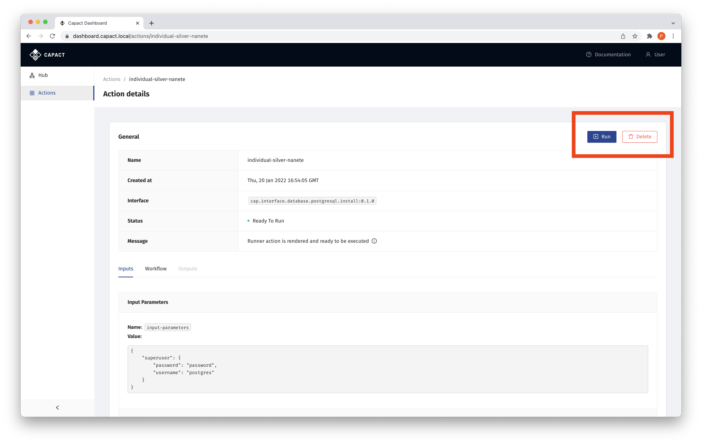

# Action management

This document describes how to manage Actions from the Capact Dashboard UI. 

## Prerequisites

- Cluster with Capact installation. See the [installation](../installation/local.mdx) tutorial.
- An user logged in Dashboard. See the [Getting started](./overview.md#) guide.

## Create Action

1. Click on the **Hub** section on the left-side menu.

    You will see all InterfaceGroups available in the Hub.

    

    Click on one of the InterfaceGroups tiles, for example **PostgreSQL**.

1. See the list of all Interfaces within a given InterfaceGroup.

    

    - You can toggle list/card view using the icons (1) on the right top side.
    - Create Action for a given Interface using the **Create Action** link (2).

1. If the selected Interface requires input parameters, you will be asked to provide them.

    
    
    Fill the form with input parameters for Interface, and click **Next**.

1. If the selected Interface requires input TypeInstances, you will be asked to provide them.

    

    Provide all required input TypeInstances and click **Next**.

1. Verify the Action details on the Action Summary.

    

    - To edit Action name, click on the pen icon (1) next to the generated Action name.
    - Switch to **Advanced Settings** (2) tab, to optionally select a specific Implementation and provide Implementation-specific input if needed.
    - To create the Action, click the **Submit** button (3).

## List Actions

To see the list of Actions, navigate to the **Actions** section on the left-side menu.
You can sort Actions by a given table column by clicking on the specific table header.


## Manage single Action

To see the details of a single Action, navigate to the **Actions** section on the left-side menu, and click either on the Action name or the eye icon:


Then you will be navigated to the Action details view, where you can display all data about a given Action - including rendered workflow, inputs and outputs.


### Run Action

To run a given Action, click the **Run** button. The button is enabled only if Action is runnable, that is, in the "Ready to Run" state.



### See Action workflow

1. To be able to use Argo Workflows UI link in the Action details view, make the Argo Workflows UI accessible with the following command:

    ```bash
    kubectl -n capact-system port-forward svc/argo-argo-workflows-server 2746
    ```

1. To see the Action workflow, switch to the **Workflow** tab in Action details view, and click the **See workflow in Argo UI** button. The button is clickable only if Action has been already run.

    

### Delete Action

To delete a given Action, click the **Delete** button. Click **Yes** button in the confirmation tooltip.

