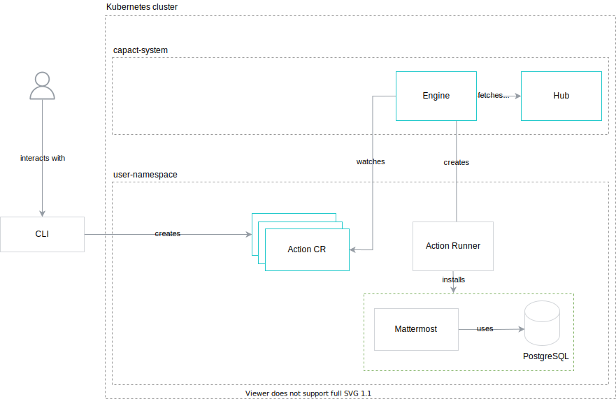
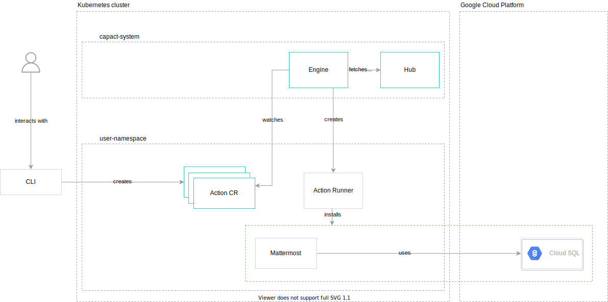
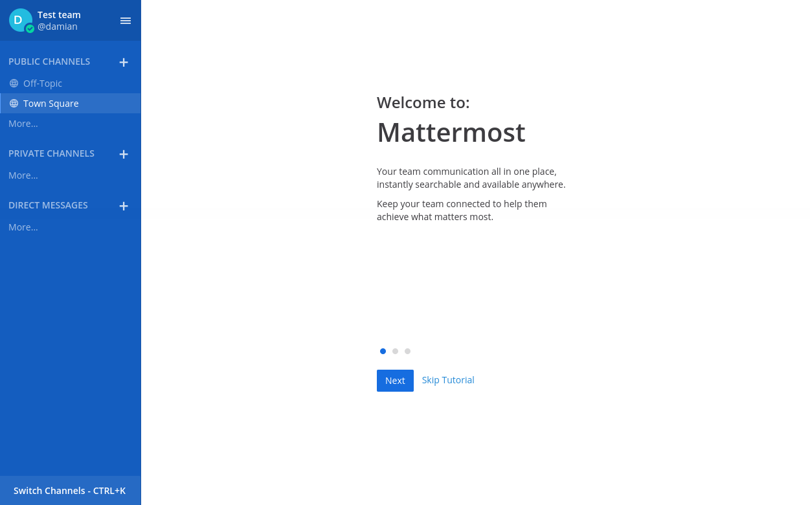

# Mattermost installation

This tutorial shows the basic concepts of Capact on the Mattermost installation example.

### Goal

This instruction will guide you through the installation of Mattermost on a Kubernetes cluster using Capact. 

Mattermost depends on the PostgreSQL database. Depending on the cluster configuration, with the Capact project, you can install Mattermost with a managed Cloud SQL database or a locally deployed PostgreSQL Helm chart.

The diagrams below show possible scenarios:

**Install all Mattermost components in a Kubernetes cluster**



**Install Mattermost with an external Cloud SQL database**



###  Prerequisites

* [Capact CLI](../cli/getting-started.mdx) installed.
* [`kubectl`](https://kubernetes.io/docs/tasks/tools/install-kubectl/) installed.
* Cluster with Capact installation. See the [installation tutorial](../installation/local.md). 
* For the scenario with Cloud SQL, access to Google Cloud Platform.  

### Install all Mattermost components in a Kubernetes cluster

By default, the Capact Engine [cluster policy](https://github.com/capactio/capact/tree/main/deploy/kubernetes/charts/capact/charts/engine/values.yaml) prefers Kubernetes solutions. 

```yaml
rules: # Configures the following behavior for Engine during rendering Action
- interface:
    path: cap.*
  oneOf:
  - implementationConstraints: # prefer Implementation for Kubernetes
      requires:
      - path: "cap.core.type.platform.kubernetes"
        # any revision
  - implementationConstraints: {} # fallback to any Implementation
```

As a result, all external solutions, such as Cloud SQL, have a lower priority, and they are not selected. The below scenario shows how to install Mattermost with a locally deployed PostgreSQL Helm chart.

#### Instructions

1. Create a Kubernetes Namespace:

    ```bash
    export NAMESPACE=local-scenario
    kubectl create namespace $NAMESPACE
    ```
 
1. Login to Capact in the CLI:

    To obtain the Gateway URL and authorization information, run:
    
    ```bash
    export CAPACT_GATEWAY_HOST=$(kubectl -n capact-system get ingress capact-gateway -ojsonpath='{.spec.rules[0].host}')
    export CAPACT_GATEWAY_USERNAME=$(kubectl -n capact-system get deployment capact-gateway -oyaml | grep -A1 "name: APP_AUTH_USERNAME" | tail -1 | awk -F ' ' '{print $2}')
    export CAPACT_GATEWAY_PASSWORD=$(kubectl -n capact-system get deployment capact-gateway -oyaml | grep -A1 "name: APP_AUTH_PASSWORD" | tail -1 | awk -F ' ' '{print $2}')
    ```

    Login using Capact CLI:
    ```bash
    capact login "$CAPACT_GATEWAY_HOST" -u "$CAPACT_GATEWAY_USERNAME" -p "$CAPACT_GATEWAY_PASSWORD"
    ```

1. List all Interfaces:

    ```bash
    capact hub interfaces get
    ```
    ```bash
                               PATH                             LATEST REVISION                           IMPLEMENTATIONS                          
    +---------------------------------------------------------+-----------------+-----------------------------------------------------------------+
      cap.interface.analytics.elasticsearch.install             0.1.0             cap.implementation.elastic.elasticsearch.install                 
                                                                                  cap.implementation.aws.elasticsearch.provision                                          
    +---------------------------------------------------------+-----------------+-----------------------------------------------------------------+
      cap.interface.automation.concourse.change-db-password     0.1.0             cap.implementation.concourse.concourse.change-db-password        
    +---------------------------------------------------------+-----------------+-----------------------------------------------------------------+
      cap.interface.automation.concourse.install                0.1.0             cap.implementation.concourse.concourse.install                   
    +---------------------------------------------------------+-----------------+-----------------------------------------------------------------+
      cap.interface.aws.elasticsearch.provision                 0.1.0             cap.implementation.aws.elasticsearch.provision                   
    +---------------------------------------------------------+-----------------+-----------------------------------------------------------------+
      cap.interface.aws.rds.postgresql.provision                0.1.0             cap.implementation.aws.rds.postgresql.provision                  
    +---------------------------------------------------------+-----------------+-----------------------------------------------------------------+
      cap.interface.database.postgresql.install                 0.1.0             cap.implementation.bitnami.postgresql.install                    
                                                                                  cap.implementation.aws.rds.postgresql.install                    
                                                                                  cap.implementation.gcp.cloudsql.postgresql.install               
                                                                                  cap.implementation.gcp.cloudsql.postgresql.install               
    +---------------------------------------------------------+-----------------+-----------------------------------------------------------------+
    ```

    The table represents all available Actions that you can execute on this Capact. There is also a list of the Implementations available for a given Interface. You can see, that for the `cap.interface.database.postgresql.install` we have:
    - a Kubernetes deployment using the Bitnami Helm chart,
    - an AWS RDS instance,
    - a GCP Cloud SQL instance.

1. Create an Action with the `cap.interface.productivity.mattermost.install` Interface:

    Create input parameters for the Action, where you provide the ingress host for the Mattermost.
    ```bash
    cat <<EOF > /tmp/mattermost-install.yaml
    ingress:
      host: mattermost.capact.local
    EOF
    ```

    > **NOTE:** The host must be in a subdomain of the Capact domain, so the ingress controller and Cert Manager can handle the Ingress properly it.
    >
    > If you use a local Capact installation, then you have to add an entry in `/etc/hosts` for it e.g.:
    > ```
    > 127.0.0.1 mattermost.capact.local
    > ```

    ```bash
    capact action create -n $NAMESPACE --name mattermost-install cap.interface.productivity.mattermost.install --parameters-from-file /tmp/mattermost-install.yaml
    ```

1. Get the status of the Action from the previous step:

    ```bash
    capact action get -n $NAMESPACE mattermost-install
    ```
    ```bash
       NAMESPACE            NAME                              PATH                         RUN       STATUS      AGE  
    +--------------+--------------------+-----------------------------------------------+-------+--------------+-----+
      gcp-scenario   mattermost-install   cap.interface.productivity.mattermost.install   false   READY_TO_RUN   19s  
    +--------------+--------------------+-----------------------------------------------+-------+--------------+-----+
    ```

    In the `STATUS` column you can see the current status of the Action. When the Action workflow is being rendered by the Engine, you will see the `BEING_RENDERED` status. After the Action finished rendering and the status is `READY_TO_RUN`, you can go to the next step.

1. Run the rendered Action:

    After the Action is in `READY_TO_RUN` status, you can run it. To do this, execute the following command:

    ```bash
    capact action run -n $NAMESPACE mattermost-install
    ```

1. Check the Action execution and wait till it is finished:
    
    ```bash
    capact action watch -n $NAMESPACE mattermost-install
    ```

1. Get the ID of the `cap.type.productivity.mattermost.config` TypeInstance:
    
    ```bash
    capact action get -n $NAMESPACE mattermost-install -ojson | jq -r '.Actions[].output.typeInstances | map(select(.typeRef.path == "cap.type.productivity.mattermost.config"))'
    ```

1. Get the TypeInstance value: 

    Use the ID from the previous step and fetch the TypeInstance value:
    ```bash
    capact typeinstance get {type-instance-id} -ojson | jq -r '.[0].latestResourceVersion.spec.value'
    ```

1. Open the Mattermost console using the **host** from the TypeInstance value, you got in the previous step.

    

🎉 Hooray! You now have your own Mattermost instance installed. Be productive!

#### Clean-up 

>⚠️ **CAUTION:** This removes all resources that you created.

When you are done, remove the Action and Helm charts:

```bash
capact action delete -n $NAMESPACE mattermost-install
helm delete -n $NAMESPACE $(helm list -f="mattermost-*|postgresql-*" -q -n $NAMESPACE)
```

### Install Mattermost with an external CloudSQL database

To change the Mattermost installation, we need to adjust our cluster policy to prefer GCP solutions. Read more about policy configuration [here](../feature/policy-configuration.md).

#### Instructions

1. Create a GCP Service Account JSON access key:
   
   	1. Open [https://console.cloud.google.com](https://console.cloud.google.com) and select your project.
   
   	2. In the left pane, go to **IAM & Admin** and select **Service accounts**.
   
   	3. Click **Create service account**, name your account, and click **Create**.
   
   	4. Assign the `Cloud SQL Admin` role.
   
   	5. Click **Create key** and choose `JSON` as the key type.
   
   	6. Save the `JSON` file.
   
   	7. Click **Done**.

1. Create a TypeInstance with the GCP Service Account:

    ```yaml
    # /tmp/gcp-sa-ti.yaml
    typeInstances:
      - alias: gcp-sa
        typeRef:
          path: cap.type.gcp.auth.service-account
          revision: 0.1.0
        attributes:
          - path: cap.attribute.cloud.provider.gcp
            revision: 0.1.0
        value: { # Put here your GCP Service Account JSON.
          "type": "service_account",
          [...]
        }
    ```

    ```bash
    export TI_ID=$(capact typeinstance create -f /tmp/gcp-sa-ti.yaml -ojson | jq -r '.[].id')
    ```

1. Update the cluster policy:

    ```bash
    cat > /tmp/policy.yaml << ENDOFFILE
    rules:
      - interface:
          path: cap.interface.database.postgresql.install
        oneOf:
          - implementationConstraints:
              attributes:
                - path: "cap.attribute.cloud.provider.gcp"
              requires:
                - path: "cap.type.gcp.auth.service-account"
            inject:
              typeInstances:
                - id: ${TI_ID}
                  typeRef:
                    path: "cap.type.gcp.auth.service-account"
                    revision: "0.1.0"
      - interface:
          path: cap.*
        oneOf:
          - implementationConstraints:
              requires:
                - path: "cap.core.type.platform.kubernetes"
          - implementationConstraints: {} # fallback to any Implementation
    ENDOFFILE
    ```

    ```bash
    capact policy apply -f /tmp/policy.yaml
    ``` 

    >**NOTE**: If you are not familiar with the policy syntax above, check the [policy configuration document](../feature/policy-configuration.md).  

1. Create a Kubernetes Namespace:

    ```bash
    export NAMESPACE=gcp-scenario
    kubectl create namespace $NAMESPACE
    ```

1. Install Mattermost with the new cluster policy:

   The cluster policy was updated to prefer GCP solutions for the PostgreSQL Interface. As a result, during the render process, the Capact Engine will select a Cloud SQL Implementation which is available in our Hub server.
   
   Repeat the steps 4–11 from [Install all Mattermost components in a Kubernetes cluster](#install-all-mattermost-components-in-a-kubernetes-cluster) in the `gcp-scenario` Namespace.


🎉 Hooray! You now have your own Mattermost instance installed. Be productive!

#### Clean-up

>⚠️ **CAUTION:** This removes all resources that you created.

When you are done, remove the Cloud SQL manually and delete the Action:

```bash
kubectl delete action mattermost-instance -n $NAMESPACE
helm delete -n $NAMESPACE $(helm list -f="mattermost-*" -q -n $NAMESPACE)
```

### Behind the scenes

The following section extends the tutorial with additional topics, to let you dive even deeper into the Capact concepts.

#### OCF manifests

A user consumes content stored in Capact Hub. The content is defined using Open Capability Format (OCF) manifests. The OCF specification defines the shape of manifests that Capact understands, such as Interface or Implementation.

To see all the manifest that Hub stores, navigate to the [Hub content structure](https://github.com/capactio/hub-manifests/tree/main/manifests).

To see the Mattermost installation manifests, click on the following links:
 - [Mattermost installation Interface](https://github.com/capactio/hub-manifests/tree/main/manifests/interface/productivity/mattermost/install.yaml) — a generic description of Mattermost installation (action name, input, and output — a concept similar to interfaces in programming languages),
 - [Mattermost installation Implementation](https://github.com/capactio/hub-manifests/tree/main/manifests/implementation/mattermost/mattermost-team-edition/install.yaml) — represents the dynamic workflow for Mattermost Installation.

#### Content development

To make it easier to develop new Hub content, we implemented a dedicated CLI. Currently, it exposes the validation feature for OCF manifests. It detects the manifest kind and the OCF version to properly validate a given file. You can use it to validate one or multiple files at a single run.

To validate all Hub manifests, navigate to the repository root directory and run the following command:

```bash
capact validate ./manifests/**/*.yaml
```

In the future, we plan to extend the Capact CLI with additional features, such as:
- manifests scaffolding,
- manifests submission,
- signing manifests.

###  Additional resources

If you want to learn more about the project, check the [`capact`](https://github.com/capactio/capact) repository.
To learn how to develop content, get familiar with the [content development guide.](../content-development/guide.md)
