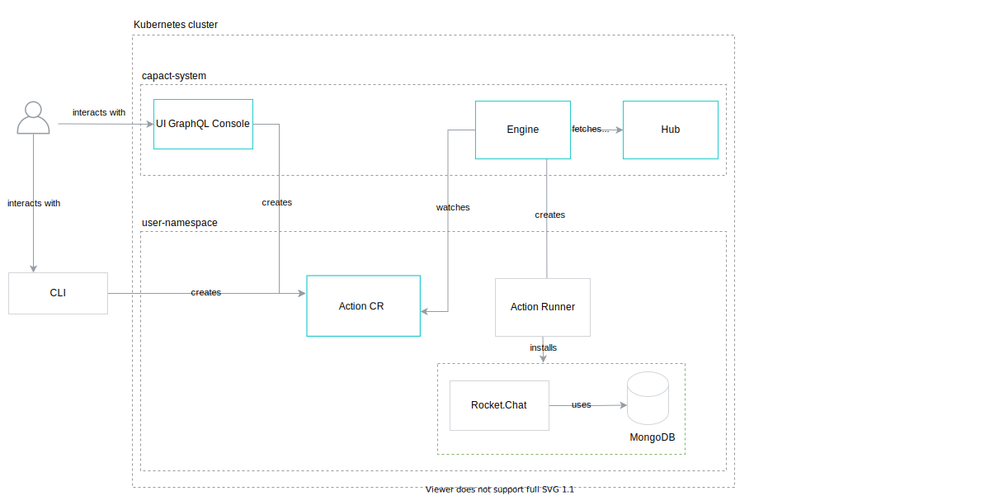
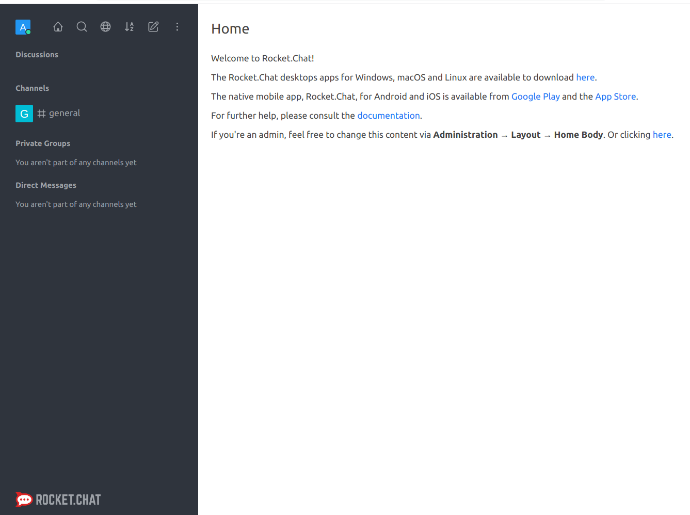
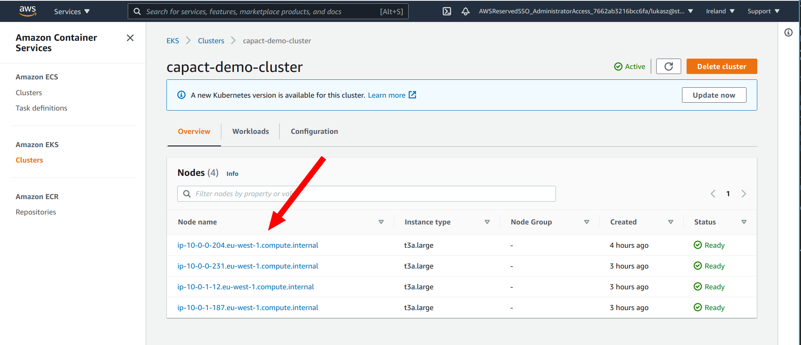
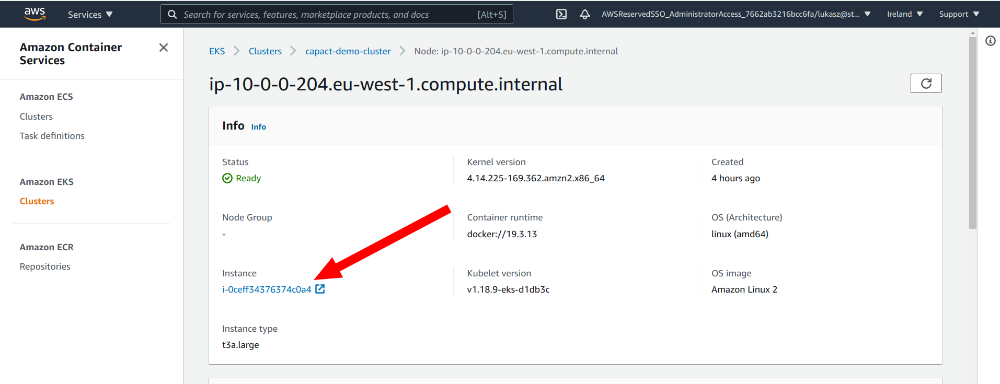
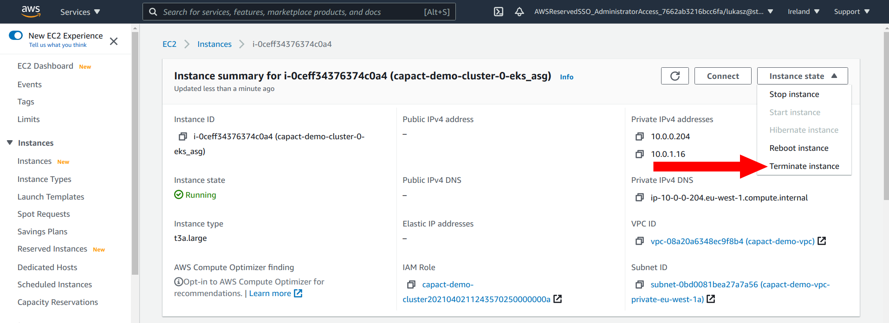

# RocketChat installation

This tutorial shows the basic concepts of Capact on the RocketChat installation example.

### Goal

This instruction will guide you through the installation of RocketChat on a Kubernetes cluster using Capact. 

RocketChat depends on the MongoDB database.

The diagram below shows the scenario:



###  Prerequisites

* Capact cluster installed, for example on [AWS EKS](../installation/aws-eks.md). See also [GCP cluster installation guide](../installation/gcp-gke.md).

> **NOTE:** For AWS EKS Capact installation, all operation need to be run from the bastion host.

The following tools are required:

* Capact CLI installed

  To build it, install Go and run:

  ```bash
  CLI_OS=linux make build-tool-cli
  chmod +x ./bin/capact-linux-amd64
  mv ./bin/capact-linux-amd64 /usr/local/bin/capact
  ```

* [`kubectl`](https://kubernetes.io/docs/tasks/tools/install-kubectl/) installed.
* [`helm`](https://helm.sh/docs/intro/install/) installed.
* [`jq`](https://stedolan.github.io/jq/) installed.

### Install all RocketChat components in a Kubernetes cluster


1. Setup Capact CLI

    To obtain the Gateway URL and password run:
    
    ```bash
    HOST=`kubectl -n capact-system get ingress capact-gateway -o go-template --template="{{ (index .spec.rules 0).host }}"`
    USERNAME=`helm -n capact-system get values capact --all -o json | jq .global.gateway.auth.username -r`
    PASSWORD=`helm -n capact-system get values capact --all -o json | jq .global.gateway.auth.password -r`
    ```

    Configure Capact CLI:

    ```bash
    capact login "https://${HOST}" -u ${USERNAME} -p ${PASSWORD}
    capact config set-context https://${HOST}
    ```

1. Make sure to separate workloads

   For a better performance and durability, it is recommended to run MongoDB and RocketChat on separate nodes. MongoDB is by default configured to prefer being run on nodes with label `node.capact.io/type=storage`. We will also configure RocketChat affinity to not schedule pods on such nodes.

   Select any worker node and replace the `<NODE NAME>` with the node name and run:

   ```bash
   kubectl label node <NODE NAME> node.capact.io/type=storage
   ```

1. Export Capact cluster domain name as environment variable:

   ```bash
   export CAPACT_DOMAIN_NAME={domain_name} # e.g. demo.cluster.capact.dev
   ``` 

1. Create a file with installation parameters:

    ```bash
    cat > /tmp/rocketchat-params.yaml << ENDOFFILE
    host: chat.${CAPACT_DOMAIN_NAME}
    replicaCount: 3
    resources:
      requests:
        memory: "2G"
        cpu: "1"
      limits:
        memory: "4G"
        cpu: "1"
    affinity:
      nodeAffinity:
        requiredDuringSchedulingIgnoredDuringExecution:
          nodeSelectorTerms:
          - matchExpressions:
            - key: node.capact.io/type
              operator: NotIn
              values:
              - storage    
    ENDOFFILE
    ```

1. Create an Action:

    ```bash
    capact action create cap.interface.productivity.rocketchat.install \
    --name rocketchat \
    --parameters-from-file /tmp/rocketchat-params.yaml
    ```

1. Get the status of the Action from the previous step:

   ```bash
   capact action get rocketchat
   ```

   Wait until the Action is in `READY_TO_RUN` state. It means that the Action was processed by the Engine, and the Interface was resolved to a specific Implementation. As a user, you can verify that the rendered Action is what you expected. If the rendering is taking more time, you will see the `BEING_RENDERED` phase.

1. Run the Action.
   
   In the previous step, the Action was in the `READY_TO_RUN` phase. It is not executed automatically, as the Engine waits for the user's approval. To execute it, execute:

   ```bash
   capact action run rocketchat
   ```

1. Watch the Action:

   ```bash
   capact action watch rocketchat
   ```

   Wait until the Action is finished.

1. Once the Action is succeeded, view output TypeInstances:

   ```bash
   capact action status rocketchat
   ```

1. Open the RocketChat UI using the **host** value from the previous step.

    

🎉 Hooray! You now have your own RocketChat instance installed. Be productive!

### Validate RocketChat high availability setup

> **NOTE**: The following steps are optional. In this tutorial we used AWS EKS Capact installation and all instructions will be based on this setup.

Now, let's validate the high-availability setup for the RocketChat.

#### Non-disruptive tests

Here we are simulating maintenance actions which should not disrupt RocketChat. Non-disruptive actions for example are:

* Rolling update of RocketChat.
* Scheduled Node maintenance where pods are evicted from the node.
* Rescheduling pod to another node.

1. List RocketChat pods

   ```bash
   kubectl get pod -l app.kubernetes.io/name=rocketchat
   ```

1. Select two random pods from the list above and delete them.

  Use `kubectl delete` command. For example:
  
  ```bash
   kubectl delete pod rocketchat-1617956008-rocketchat-5b45b74f77-pncck
   ```

   > **NOTE:** Make sure that at least one pod is in *Ready* state.

1. Verify if RocketChat is still running without any disruption.

#### Disruptive tests

Here we are simulating scenario when Kubernetes lost a connection to one of the worker nodes.

1. Make sure that MongoDB and RocketChat pods are running on different nodes.

   To list pods and assigned nodes run:

   ```bash
   kubectl get pod -o wide
   ```

1. Make sure that the pod with `public-ingress-nginx` prefix is not running on the same nodes as RocketChat.

   ```bash
   kubectl -n capact-system get pod -o wide
   ```

1. Get a list of nodes where RocketChat pods are running:

   ```bash
   kubectl get pod -o go-template --template='{{ range .items}}{{.metadata.name}} - {{ .spec.nodeName }}{{"\n"}}{{end}}'
   ```

    Choose one of them and note the node name.

1. Terminate the selected worker node from the EKS console.

   To terminate note go to the cluster main page. In the *Overview* section click on the selected node. In the **Info** section click a link under **Instance** name. New tab will be opened. From the menu in the top right select **Terminate instance** option

   
   
   
   
1.  Open the RocketChat site again using provided host during RocketChat installation. It should be still accessible.

    > **NOTE**: Depending on which node will be deleted and to which RocketChat Pod you are connected, it may take up to 30 seconds for Kubernetes to change configuration. During that time RocketChat may not be available.


### Clean-up 

>⚠️ **CAUTION:** This removes all resources that you created.

When you are done, remove the Action and Helm charts:

```bash
capact action delete rocketchat
helm delete $(helm list -f="rocketchat-*|mongodb-*" -q
```

###  Additional resources

See the (Content Development guide](../content-development/guide.md), to understand how to develop OCF content for Capact.

If you want to learn more about the project, check the [`capact`](https://github.com/capactio/capact) repository.

