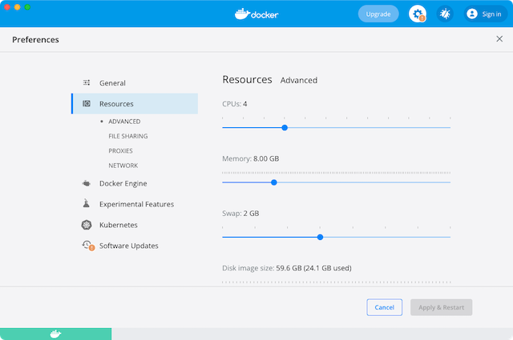

# Local Installation

Use Capact CLI to create a local Kubernetes cluster and install Capact on it.

## Prerequisites

- [Docker](https://www.docker.com/) installed
- Capact CLI installed according to the [Getting Started](./../cli/getting-started.mdx#install) guide

### CPU and memory requirements

Capact consists of multiple components, which you can find in [`deploy/kubernetes/charts`](https://github.com/capactio/capact/tree/main/deploy/kubernetes/charts). Make sure that Docker has enough resources to install Capact properly.

#### Minimal:
- 2 CPU cores
- 4GB RAM

#### Recommended:
- 4 CPU cores
- 8GB RAM

:::note
While on Linux Docker runs natively, being able to use all CPU and memory if needed, on macOS you need to configure resources manually for Docker virtual machine.

Please check the [Docker manual](https://docs.docker.com/desktop/mac/#resources) in order to learn how to configure CPU and memory.

<div style={{textAlign: 'center'}}>



</div>
:::

## Create local Kubernetes cluster

To create a local cluster, run the following command:

import Tabs from '@theme/Tabs';
import TabItem from '@theme/TabItem';

<Tabs
	groupId="ref"
	defaultValue="kind"
	values={[
		{label: 'Kind', value: 'kind'},
		{label: 'K3d', value: 'k3d'},
	]}>
<TabItem value="kind">

```bash
capact environment create kind --wait 5m
```

:::note
You can customize the behavior with additional flags. See all the options in the [`capact environment create kind`](../cli/commands/capact_environment_create_kind.md) command documentation.
:::

</TabItem>
<TabItem value="k3d">

```bash
capact environment create k3d --wait 5m
```

:::note
You can customize the behavior with additional flags. See all the options in the [`capact environment create k3d`](../cli/commands/capact_environment_create_k3d.md) command documentation.
:::

</TabItem>
</Tabs>

## Install Capact

Once you have your local Kubernetes cluster set up, install Capact. You can choose from two types of release channels:

- **Stable** - refers to the official [Capact releases](https://github.com/capactio/capact/releases).
- **Latest** - refers to the latest successful build from the commit on the [Capact repository `main` branch](https://github.com/capactio/capact/commits/main).

:::tip
By default all Capact components are installed. You can disable monitoring installation to reduce time and resource consumption.

To install Capact without `monitoring`, add the `--install-component=capact,neo4j,ingress-nginx,argo,cert-manager,kubed` flag to the `capact install` command.
:::

<Tabs
	groupId="ref"
	defaultValue="stable"
	values={[
		{label: 'Stable', value: 'stable'},
		{label: 'Latest', value: 'latest'},
	]}>
<TabItem value="stable">

```bash
capact install
```

Wait for the command to finish.

</TabItem>
<TabItem value="latest">

```bash
capact install --version @latest --helm-repo @latest
```

Wait for the command to finish.

</TabItem>
</Tabs>


:::note
You can customize the behavior with additional flags. See all the options in the [`capact install`](../cli/commands/capact_install.md) command documentation.
:::

## Next steps

Configure Capact CLI to connect to your fresh local Capact installation. Follow the steps in the [First use](../cli/getting-started.mdx#first-use) section of the CLI Getting started guide. Enjoy using Capact!

## Cleanup

To remove your local Kubernetes cluster created in the [Create local Kubernetes cluster](#create-local-kubernetes-cluster) section, run the following command:

:::danger
This command deletes the local cluster with all data, including history of executed Actions and created TypeInstances. Before running it, make sure you cleaned up all external resources (e.g. managed PostgreSQL databases) based on the TypeInstance data.
:::

<Tabs
groupId="ref"
defaultValue="kind"
values={[
{label: 'Kind', value: 'kind'},
{label: 'K3d', value: 'k3d'},
]}>
<TabItem value="kind">

```bash
capact environment delete kind
```

</TabItem>
<TabItem value="k3d">

```bash
capact environment delete k3d
```

</TabItem>
</Tabs>
