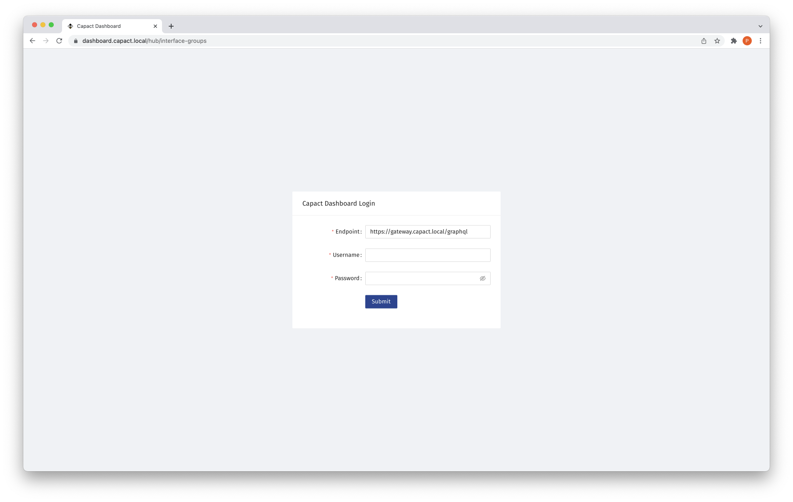

# Overview

Dashboard is a convenient, web-based UI for managing Capact resources. It comes as a built-in Capact component, enabled by default.

> **NOTE:** Capact Dashboard is still at an early stage of development and has a basic set of features. Over time it will become more powerful, and our documentation will be updated to describe how it can be used as an alternative for CLI.

## Prerequisites

- Cluster with Capact installation. See the [installation tutorial](../installation/local.mdx).

## Get started

1. Get credentials for login to the Capact Dashboard.

    Run the following command to obtain and print user credentials:

    ```bash
    export GATEWAY_USER=$(kubectl -n capact-system get secret capact-gateway -ogo-template='{{.data.username | base64decode }}')
    export GATEWAY_PASS=$(kubectl -n capact-system get secret capact-gateway -ogo-template='{{.data.password | base64decode }}')
    print "Username: ${GATEWAY_USER}\nPassword: ${GATEWAY_PASS}"
    ```

    Note the output of this command.

1. Navigate to the `https://dashboard.{domain}` URL, where the `{domain}` is the domain used for Capact installation.

    For example, for local installation, the Dashboard URL is `https://dashboard.capact.local`.

1. You will see Capact Dashboard login form.

    

    Use the credentials from the first step of this instruction to log in.
    
1. As now you are logged in, you are ready to explore the Capact Dashboard features!

    

## Advanced configuration

You can configure Capact Dashboard in runtime, by editing ConfigMap:

```bash
kubectl edit configmap -n capact-system capact-dashboard-runtime-cfg
```

To read possible configuration options, see the [Configuration](https://github.com/capactio/dashboard#configuration) section in Dashboard Readme.

Currently, these settings won't be preserved between Capact installation upgrades.

## See also

If you would rather manage Capact resources with CLI tool, read the [Getting started](../cli/getting-started.mdx) document. As Capact CLI is more mature, currently it is packed with more features.
